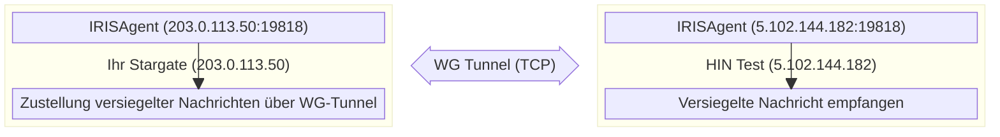
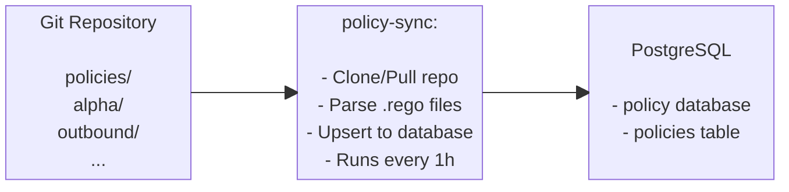

# Stargate Docker erweiterte Konfiguration

## Backups

### Automatische Backups

* Tägliche Backups um 2:00 Uhr morgens via Cron (während der Installation eingerichtet)
* Backups werden in `./backups/` als mit Zeitstempel versehene `.tar.gz`-Dateien gespeichert
* Alte Backups (>7 Tage) werden automatisch bereinigt

### Was in Backups enthalten ist

* **Vollständiger PostgreSQL-Dump** (alle Datenbanken mit Benutzern und Berechtigungen)
* **Individuelle Datenbank-Dumps** (für eine teilweise Wiederherstellung, falls erforderlich)
* **Vault-Schlüssel** (`vault-keys.json` zum Entsiegeln)
* **Kundenkonfiguration** (`customer-config.sh` mit WireGuard-Schlüssel)
* **S/MIME-CSR und Zertifikate** (alle `.crt`, `.pem`, `.cer`-Dateien)
* **Backup-Manifest** (`manifest.json` mit Metadaten)

### Manuelles Backup

```bash
./scripts/backup.sh
```

Erstellt ein komprimiertes Archiv in `./backups/YYYYMMDD_HHMMSS.tar.gz`.

### Wiederherstellung aus einem Backup

Zur Wiederherstellung auf einem **neuen System** oder nach einer **Bereinigung**. Kopieren Sie das Backup-Archiv auf das neue System und führen Sie es aus:

```bash
./scripts/restore.sh backups/20260130_143022.tar.gz
```

Das Wiederherstellungsskript wird:

1. Alle laufenden Dienste anhalten
2. Das Backup extrahieren und validieren
3. Docker installieren, falls erforderlich
4. Die Kundenkonfiguration wiederherstellen
5. Die Infrastrukturdienste starten (PostgreSQL, Vault, MinIO)
6. Die Datenbank wiederherstellen
7. Vault mit den gesicherten Schlüsseln entsiegeln
8. Die Anwendungsdienste starten

### Teilweise Wiederherstellung (einzelne Datenbank)

Wenn Sie nur eine Datenbank wiederherstellen müssen:

#### Backup extrahieren

```bash
tar -xzf backups/20260130_143022.tar.gz -C /tmp/
```

#### Eine bestimmte Datenbank wiederherstellen

```bash
cat /tmp/20260130_143022/database/mxengine.sql | docker exec -i stargate-postgres psql -U postgres -d mxengine
```

## Stargate aktualisieren

### Bereitstellungsskripte und Konfiguration aktualisieren

Das Stargate-Bereitstellungs-Repository erhält Aktualisierungen für Skripte (`install.sh`, `start.sh`, `health-check.sh`, `restore.sh`, usw.), Konfigurationsvorlagen und Dokumentation. Um diese Aktualisierungen zu übernehmen:

#### 1. Erstellen Sie ein Backup vor der Aktualisierung

```bash
./scripts/backup.sh
```

#### 2. Die neuesten Änderungen aus dem Repository pullen

```bash
git pull
```

#### 3. Dienste neu starten, um Skript- oder Konfigurationsänderungen zu übernehmen

```bash
./scripts/stop.sh
./scripts/start.sh
```

!!! note
    `git pull` überschreibt nicht Ihre `customer-config.sh`, `.env` oder das `secrets/`-Verzeichnis – diese befinden sich in `.gitignore`. Wenn Sie lokale Änderungen an nachverfolgten Dateien (z.B. `docker-compose.yml`) haben, wird git Sie warnen. In diesem Fall stashen Sie Ihre Änderungen zuerst mit `git stash`, pullen und wenden dann mit `git stash pop` erneut an.

Wenn das Update Änderungen an der Konfigurationsvorlage enthält, vergleichen Sie diese mit Ihrer vorhandenen Konfiguration, um zu sehen, ob neue Variablen hinzugefügt wurden:

```bash
diff customer-config.sh customer-config-prod.example.sh
```

### Service-Images aktualisieren

#### Einen einzelnen Service aktualisieren

Bearbeiten Sie die Version in `.env`:

```bash
sed -i 's/MXENGINE_VERSION=.*/MXENGINE_VERSION=v0.0.31/' .env
```

Dann den Container pullen und neu erstellen:

```bash
docker compose pull mxengine
docker compose up -d --force-recreate mxengine
```

#### Kurztest (ohne Bearbeitung der .env)

Version direkt überschreiben:

```bash
MXENGINE_VERSION=v0.0.31 docker compose up -d --force-recreate mxengine
```

#### Mehrere Dienste aktualisieren

Versionen in `.env` bearbeiten, dann Container pullen und neu erstellen:

```bash
docker compose pull smimekeys-client policy irisagent mxengine
docker compose up -d --force-recreate smimekeys-client policy irisagent mxengine
```

#### Alle Dienste aktualisieren

Alle neuesten Images pullen

```bash
docker compose pull
```

Alle Dienste neu erstellen

```bash
docker compose up -d --force-recreate
```

#### Alte Images bereinigen

Nach den Updates entfernen Sie nicht verwendete Images, um Speicherplatz freizugeben:

```bash
docker image prune -f
```

#### Rollback

Um ein Rollback durchzuführen, bearbeiten Sie `.env` auf die vorherige Version und erstellen Sie neu:

```bash
sed -i 's/MXENGINE_VERSION=.*/MXENGINE_VERSION=v0.0.30/' .env
docker compose up -d --force-recreate mxengine
```

## Konfiguration

Die `.env`-Datei wird von `install.sh` aus `customer-config.sh` generiert. Domain-, Zertifikats- und WireGuard-Einstellungen werden zur Laufzeit über das Dashboard (`/installation`, `/onboarding`, `/mail`) verwaltet – sie werden nicht in `.env` gespeichert. Um die Installationszeiteinstellungen anzupassen, bearbeiten Sie `customer-config.sh` und führen Sie `install.sh` erneut aus.

Wichtige Abschnitte in der generierten `.env`:

```bash
## PostgreSQL (automatisch generiert, falls in customer-config.sh leer)
POSTGRES_USER=postgres
POSTGRES_PASSWORD=<automatisch-generiert>

## Vault (nach der Initialisierung automatisch ausgefüllt)
VAULT_TOKEN=<automatisch-generiert>

## S3 Object Storage (SeaweedFS)
S3_ACCESS_KEY=minioadmin
S3_SECRET_KEY=<automatisch-generiert>

## Anwendungsversionen
SMIMEKEYS_VERSION=v0.0.5
POLICY_VERSION=v0.0.5
IRISAGENT_VERSION=v0.0.6-branch
MXENGINE_VERSION=v0.0.35
MTACONF_VERSION=dev

## Mail Outbound Pfad
MXENGINE_PUBLIC_ADDRESS=http://203.0.113.50:8084
OUTBOUND_SEALER_MX_DOMAIN=hintest.ch

## WireGuard
WG_LOCAL_IP=203.0.113.50
WG_INTERFACE_PORT=19818
WG_TRANSPORT_MODE=tcp
```

!!! warning
    **Bearbeiten Sie `.env` nicht direkt.** Änderungen werden bei erneuter Ausführung von `install.sh` überschrieben. Für die Laufzeitkonfiguration (Domains, Hostname, Peers, S/MIME) verwenden Sie das Dashboard.

## Service-URLs

| Service | URL/Port |
|---------|----------|
| Dashboard | <https://localhost> |
| smimekeys-client | <http://localhost:8081> |
| policy | <http://localhost:8082> |
| irisagent | <http://localhost:8083> |
| mxengine HTTP | <http://localhost:8084> |
| Stalwart SMTP | localhost:25 |
| APISIX Gateway | <http://localhost:9080> |
| Keycloak | <https://localhost:8180> |

## Health Checks

Alle Dienste machen einen `/liveness`-Endpunkt verfügbar:

```bash
curl http://localhost:8081/liveness  # smimekeys-client
curl http://localhost:8082/liveness  # policy
curl http://localhost:8083/liveness  # irisagent
curl http://localhost:8084/liveness  # mxengine
```

## Überwachung

### Prometheus-Metriken

Alle Anwendungsdienste machen Prometheus-Metriken intern auf Port 2112 verfügbar, die verschiedenen Host-Ports zugeordnet sind:

| Service | Metrik-Port | Metrik-URL |
|---------|--------------|-------------|
| smimekeys-client | `2113` | <http://localhost:2113/metrics> |
| irisagent | `2114` | <http://localhost:2114/metrics> |
| policy | `2115` | <http://localhost:2115/metrics> |
| mxengine | `2116` | <http://localhost:2116/metrics> |
| node-exporter | `9100` | <http://localhost:9100/metrics> |

### Prometheus Scrape Konfigurationsbeispiel

```yaml
scrape_configs:
  - job_name: 'stargate-smimekeys'
    static_configs:
      - targets: ['<host>:2113']
  - job_name: 'stargate-irisagent'
    static_configs:
      - targets: ['<host>:2114']
  - job_name: 'stargate-policy'
    static_configs:
      - targets: ['<host>:2115']
  - job_name: 'stargate-mxengine'
    static_configs:
      - targets: ['<host>:2116']
  - job_name: 'stargate-node'
    static_configs:
      - targets: ['<host>:9100']
```

### Schnelle Metrik-Überprüfung

```bash
## Alle Metrik-Endpunkte prüfen
curl -s http://localhost:2113/metrics | head -20  # smimekeys-client
curl -s http://localhost:2114/metrics | head -20  # irisagent
curl -s http://localhost:2115/metrics | head -20  # policy
curl -s http://localhost:2116/metrics | head -20  # mxengine
curl -s http://localhost:9100/metrics | head -20  # node-exporter
```

### Log-Sammlung (Alloy → Loki)

Alloy sammelt Logs von Anwendungscontainern und sendet sie an Loki.

**Überwachte Container:**

* stargate-apisix
* stargate-keycloak
* stargate-dashboard
* stargate-smimekeys-client
* stargate-policy
* stargate-policy-sync
* stargate-irisagent
* stargate-mxengine

**Konfiguration** in `.env`:

```env
## Loki Push-URL
LOKI_URL=https://loki.example.com

## Hostname-Label für Logs (automatisch auf DEPLOYMENT_NAME gesetzt)
ALLOY_HOSTNAME=stargate-acme
```

**Zu Logs hinzugefügte Labels:**

* `environment=<DEPLOYMENT_NAME>` - Identifiziert die Bereitstellung
* `host=<ALLOY_HOSTNAME>` - Identifiziert den Host (gleich wie Bereitstellungsname)
* `container=<container-name>` - Containername
* `service=<service-name>` - Dienstname (z.B. smimekeys-client, policy)
* `level=<log-level>` - Aus JSON-Logs extrahiert, falls verfügbar

**Logs in Grafana abfragen:**

```logql
{environment="stargate-acme"} |= "error"
{environment="stargate-acme", service="mxengine"}
{environment="stargate-acme", level="error"}
```

**Überprüfen, ob Alloy funktioniert:**

=== "Alloy-Status und letzte Aktivität prüfen"

    ```bash
    docker logs stargate-alloy
    ```

=== "Health-Probe (aus dem Docker-Netzwerk)"

    ```bash
    docker exec stargate-alloy wget -qO- http://localhost:12345/-/ready
    ```

**Hinweis:** Die öffentliche IP der VM muss in der Ingress-Konfiguration von Loki auf die Whitelist gesetzt werden.

## Stalwart MTA + mtaconf

Stargate verwendet **Stalwart** als Mail Transfer Agent und **mtaconf** als Konfigurations-Daemon. Das Dashboard sendet Domain- und Relay-Konfiguration an die REST-API von mtaconf, die diese dann über die Verwaltungs-CLI an Stalwart weitergibt.

### Mail-Fluss-Architektur

```plain
Externer Mail-Server
         │
         ▼ (Port 25)
┌─────────────────────────────────────────────────────┐
│ stalwart (stargate-stalwart)                        │
│                                                     │
│  Port 25 (smtp listener)                            │
│    │                                                │
│    ▼                                                │
│  content_filter → smtp:[mxengine]:1587              │
│    │                                                │
└────┼────────────────────────────────────────────────┘
     │
     ▼ (Port 1587)
┌─────────────────────────────────────────────────────┐
│ MXEngine (stargate-mxengine)                        │
│                                                     │
│  Port 1587 (SMTP input)                             │
│    │                                                │
│    ▼                                                │
│  E-Mail signieren/verschlüsseln/verarbeiten         │
│    │                                                │
│    ▼                                                │
│  Zurück an stalwart zur Weiterleitung               │
│    │                                                │
└────┼────────────────────────────────────────────────┘
     │
     ▼ (Port 10026)
┌─────────────────────────────────────────────────────┐
│ stalwart (stargate-stalwart)                        │
│                                                     │
│  Port 10026 (reinject listener)                     │
│    │                                                │
│    ▼                                                │
│  transport → relay to destination MX                │
│    │                                                │
└────┼────────────────────────────────────────────────┘
     │
     ▼ (Port 25)
Ziel-Mail-Server (via MX-Lookup)
```

**Antiviren-Scan:** Eingehende E-Mails werden von **ClamAV** (`stargate-clamav`) gescannt, das als Milter in die SMTP-DATA-Phase sowohl beim öffentlichen (`:25`) als auch beim Reinjektions- (`:10026`) Listener eingebunden ist. Infizierte E-Mails werden auf SMTP-Ebene abgewiesen; wenn ClamAV nicht erreichbar ist, wird die Nachricht zurückgestellt anstatt ungescannt zugestellt (Fail-Closed). Die Signaturdatenbank von ClamAV befindet sich im `clamav_data`-Volume und wird von freshclam im Hintergrund aktuell gehalten.

**Seal-Callback-Fluss (eingehend):** Wenn ein entferntes Sealer-Gerät eine versiegelte Nachricht zustellen muss, ruft es `MXENGINE_PUBLIC_ADDRESS` auf (Standard: `http://<SERVER_STATIC_IP>:8084`). Deshalb muss Port 8084 für eingehenden Datenverkehr geöffnet sein. Das `http://`-Protokoll ist korrekt – TLS ist nicht erforderlich, da die Seal-Nutzlast bereits verschlüsselt ist.

### Mail-Relay-Konfiguration

Die gesamte Mail-Konfiguration, die pro Bereitstellung variiert (Mail-Domains, Hostname, Relay-Host, pro-Domain-Relay-Maps, erlaubte Netzwerke), wird zur Laufzeit über die **`/mail`-Seite des Dashboards** festgelegt. Das Dashboard sendet die Konfiguration per POST an die REST-API von mtaconf, die sie auf Stalwart anwendet, ohne den Container neu starten zu müssen.

Es gibt keine pro-Domain-Konfiguration in `customer-config.sh` oder `.env` – Betreiber fügen Domains über die Benutzeroberfläche hinzu oder ändern sie.

### Mail-Routing (Migration von altem MGW)

!!! tip "Wichtiger Unterschied zum alten HIN-MGW"
    Im alten MGW mussten Sie manuell einen Zielserver pro Domain konfigurieren. In Stargate wird das Mail-Routing standardmäßig durch **DNS-MX-Einträge** entschieden – Stalwart löst zur Zustellzeit die MX jeder Domain auf. Die `/mail`-Seite des Dashboards ermöglicht es Ihnen, dies pro Domain zu überschreiben (z.B. um zurück zu Ihrem M365-/Exchange-Mandanten weiterzuleiten), ohne DNS ändern zu müssen.

**Standard – automatisch via DNS MX:**

Stellen Sie für jede Ihrer Domains sicher, dass es einen MX-Eintrag im DNS gibt, der auf den entsprechenden Exchange- (oder anderen Mail-) Server verweist:

```plain
domain1.com    MX 10  exchange1.domain1.com
domain2.com    MX 10  exchange2.domain2.com
domain3.com    MX 10  exchange3.domain3.com
```

Dies funktioniert für beliebig viele Domains – jede Domain kann auf einen anderen Mail-Server verweisen, und Stalwart leitet entsprechend weiter.

**Wenn Stargate der einzige MX-Eintrag** für eine Domain ist, filtert Stalwart diesen heraus und hat kein Zustellziel. Fügen Sie einen zweiten MX-Eintrag hinzu, der auf Ihren Mail-Server verweist, mit einer höheren Priorität (= niedrigere Zahl), damit Stalwart ihn als Zustellziel verwendet:

```plain
example.com    MX 10  exchange.example.com      ← Zustellziel (Mail-Server)
example.com    MX 20  stargate.example.com      ← Eingangs-Gateway (Stargate)
```

**Alternative – explizites pro-Domain-Relay (senderbasiert):**

Für die Weiterleitung zurück über M365 / Exchange Online konfigurieren Sie pro-Domain-Relay-Ziele über die `/mail`-Seite des Dashboards. E-Mails von Absendern, die nicht in der Map enthalten sind, fallen auf die MX-Lookup zurück.

### Ports

| Port | Zweck |
|------|---------|
| `25` | Haupt-SMTP-Listener (externe Verbindungen) |
| `10026` | Reinjektionsport (mxengine → stalwart, nur intern) |
| `1587` | MXEngine SMTP-Eingang (stalwart → mxengine, nur intern) |
| `8080` | Stalwart-Verwaltungs-API + mtaconf-REST-API (nur intern) |

!!! question "Verwenden Sie Exchange?"
    Siehe [Exchange-Integration](Exchange-integration.md) für die vollständige Einrichtung von Exchange Online / On-Premises-Connectoren und Transportregeln.

### Überprüfung

Stalwart-Status prüfen
```bash
docker exec stargate-stalwart stalwart-cli -u http://localhost:8080 server list-listeners
```

Logs prüfen
```bash
docker logs stargate-stalwart
```

Verbindung zu Port 25 testen
```bash
telnet localhost 25
```

Internen Port 10026 testen (vom mxengine-Container aus)
```bash
docker exec stargate-mxengine nc -zv stalwart 10026
```

### Das mtaconf-Image aktualisieren

Der mtaconf-Container wird aus der Registry gezogen. Um auf einen neuen Tag zu aktualisieren:

```bash
sed -i 's/MTACONF_VERSION=.*/MTACONF_VERSION=<new-tag>/' .env
docker compose pull mtaconf
docker compose up -d mtaconf
```

### Stargate-Fehlerbehebung

**E-Mail wird nicht von mxengine verarbeitet**:

* Prüfen Sie, ob content_filter konfiguriert ist: Überprüfen Sie die mtaconf-Logs auf erfolgreichen Push
* Stellen Sie sicher, dass mxengine erreichbar ist: `docker exec stargate-stalwart nc -zv mxengine 1587`

**E-Mail bleibt nach der mxengine-Verarbeitung hängen**:

* Prüfen Sie die mxengine-Outbound-Konfiguration: OUTBOUND_SMTP_HOST=stalwart, OUTBOUND_SMTP_PORT=10026
* Stellen Sie sicher, dass der Port-10026-Listener in Stalwart aktiv ist
* Prüfen Sie die erlaubten Relay-Netzwerke, ob sie das Docker-Netzwerk (172.x.x.x/16) enthalten

**Greylisting-Fehler (450 4.7.1)**:

* Das ist normal! Der Zielserver lehnt die E-Mail vorübergehend ab
* Stalwart wiederholt den Vorgang automatisch nach einer konfigurierbaren Verzögerung
* Prüfen Sie die Warteschlange über die Verwaltungs-API

**Microsoft blockiert IP (S3140)**:

* Die IP Ihres Servers hat einen schlechten Ruf bei Microsoft
* Fordern Sie die Delistung an unter: <https://sender.office.com>
* Kann 24-48 Stunden dauern, bis sie wirksam wird

**DNS-Lookup-Fehler**:

* Verwenden Sie die `/mail`-Seite des Dashboards, um einen expliziten Relay-Host oder eine pro-Domain-Relay-Map festzulegen (überspringt die MX-basierte Erkennung)

**Verbindungsverweigerung auf Port 25**:

* Stellen Sie sicher, dass Port 25 nicht durch die Firewall blockiert wird
* Prüfen Sie, ob ein anderer Dienst Port 25 verwendet: `ss -tlnp | grep :25`

## WireGuard (Agent-zu-Agent-Kommunikation)

IRISAgent verwendet WireGuard, um sichere verschlüsselte Tunnel zwischen Stargate-Instanzen für die Zustellung versiegelter Nachrichten einzurichten.

### Wie es funktioniert

Jede Stargate-Instanz verwendet die reale statische öffentliche IP des Servers als WireGuard-Tunneladresse. Dies garantiert Eindeutigkeit über alle Bereitstellungen hinweg ohne manuelle Koordination.



### WireGuard-Konfiguration

WireGuard-Einstellungen in `customer-config.sh`:

```bash
## ==============================================================================
## Server-IP – wird als WireGuard-Tunneladresse und MXEngine-Callback-URL verwendet
## ==============================================================================
SERVER_STATIC_IP="203.0.113.50"       # Die reale statische öffentliche IP Ihres Servers

## ==============================================================================
## WireGuard lokale Einstellungen (normalerweise bei Standardwerten belassen)
## ==============================================================================
WG_PRIVATE_KEY=""                     # Wird von IRISAgent automatisch generiert und dann zurück in die Konfiguration gespeichert
WG_INTERFACE_PORT="19818"             # Standard-WireGuard-Port
WG_TRANSPORT_MODE="tcp"               # "tcp" (Standard) oder "udp"

```

!!! info
    **`WG_LOCAL_IP`** wird automatisch von `SERVER_STATIC_IP` abgeleitet. Sie müssen es nicht separat festlegen.

### Peer-Verbindung einrichten

WireGuard-Peer-Details (öffentlicher Schlüssel, Endpunkt, erlaubte IPs usw.) werden zur Laufzeit über die `/installation`-Seite des Dashboards konfiguriert. Es gibt keinen `WG_PEER_*`-Block mehr in `customer-config.sh` – der Peer wird eingerichtet, nachdem der Stack gestartet ist.

Für die erstmalige Einrichtung mit der HIN-Testumgebung:

1. Starten Sie den Stack mit `./scripts/install.sh`.
2. Öffnen Sie das Dashboard, folgen Sie `/installation`, um den Nonce/HIN-Handshake zu starten.
3. Öffnen Sie die IRISAgent-Logs (`docker compose logs irisagent`) und kopieren Sie die Zeile `wireguard public key:`. Senden Sie sie zusammen mit `DEPLOYMENT_NAME` und `SERVER_STATIC_IP` an Vereign (<kalin.canov@vereign.com>), damit sie Ihren Peer auf der CA-Seite registrieren können.
4. Nachdem Vereign die Registrierung bestätigt hat, schließen Sie `/onboarding` im Dashboard ab, um das S/MIME-Zertifikat auszustellen.

Für jeden **zusätzlichen** Peer (Peer-to-Peer zwischen zwei Stargates) tauschen Sie öffentliche Schlüssel + Endpunkte mit der anderen Partei aus und fügen die Verbindung über die IRISAgent-API hinzu:

```bash
curl --location 'localhost:8083/v1/connections' \
--header 'Content-Type: application/json' \
--header 'Accept: application/json' \
--data '{
  "allowedIps": "<IP des neuen Peers>/32",
  "description": "<kurze Beschreibung>",
  "endpoint": "<IP des neuen Peers>:19818",
  "externalId": [
    "<Domain des neuen Peers>"
  ],
  "name": "<Name des neuen Peers>",
  "presharedKey": "",
  "publicKey": "<öffentlicher Schlüssel des neuen Peers>",
  "status": "completed",
  "transport": "tcp",
  "wireguardIp": "<IP des neuen Peers>",
  "wireguardPort": 10080
}'
```

### WireGuard-Überprüfung

IRISAgent-WireGuard-Schnittstelle prüfen

```bash
docker exec stargate-irisagent wg show
```

Verbindung in der Datenbank prüfen

```bash
docker exec stargate-postgres psql -U postgres -d irisagent \
  -c "SELECT connection_id, name, endpoint, wireguard_ip, transport, status FROM connections;"
```

Verbindungs-Externe-IDs prüfen (für Routing verwendet)

```bash
docker exec stargate-postgres psql -U postgres -d irisagent \
  -c "SELECT connection_id, external_id FROM connection_external_ids;"
```

WireGuard-Konnektivität testen (Tunnelstatus vom Host aus prüfen)

```bash
docker logs stargate-irisagent 2>&1 | grep -i "handshake\|peer.*added\|started listening"
```

IRISAgent-Logs auf Tunnelaktivität prüfen

```bash
docker logs stargate-irisagent | grep -i wireguard
```

### WireGuard-Fehlerbehebung

**Keine WireGuard-Schnittstelle:**

* IRISAgent-Logs prüfen: `docker logs stargate-irisagent`
* Stellen Sie sicher, dass `WG_LOCAL_IP` in `.env` gesetzt ist (automatisch von `SERVER_STATIC_IP` abgeleitet – sollte die statische öffentliche IP dieses Servers sein)

**Peer nicht erreichbar:**

* Stellen Sie sicher, dass der entfernte Endpunkt erreichbar ist: `nc -zv <endpoint_host> <endpoint_port>`
* Prüfen Sie, ob die Firewall TCP+UDP Port 19818 erlaubt
* Stellen Sie sicher, dass die öffentlichen Schlüssel auf beiden Seiten übereinstimmen
* Wenn TCP Probleme bereitet, versuchen Sie, `WG_TRANSPORT_MODE="udp"` in customer-config.sh zu setzen

**Verbindung nicht in der Datenbank:**

* Führen Sie die `/installation`-Seite des Dashboards erneut aus, um die Peer-Verbindung neu herzustellen
* Prüfen Sie die Irisagent-Logs: `docker logs stargate-irisagent`

## Policy Sync

Der `policy-sync`-Dienst synchronisiert automatisch OPA/Rego-Richtlinien aus einem Git-Repository in die PostgreSQL-Datenbank.

### Wie Policy Sync funktioniert



### Policy-Sync-Konfiguration

Einstellungen in `customer-config.sh`:

```bash
## Git-Repository mit Richtlinien (vorkonfiguriert mit HIN Stargate-Richtlinien)
POLICY_SYNC_REPO_URL="https://github.com/Health-Info-Net-AG/Stargate-policies.git"

## Optional: Authentifizierung für private Repositories
POLICY_SYNC_REPO_USER=""
POLICY_SYNC_REPO_PASS=""

## Optional: Bestimmter Branch (Standard: main)
POLICY_SYNC_REPO_BRANCH=""

## Optional: Unterordner im Repository, der die Richtlinien enthält
POLICY_SYNC_REPO_FOLDER=""

## Synchronisierungsintervall (Standard: 1h)
POLICY_SYNC_INTERVAL="1h"
```

### Policy-Sync-Überprüfung

=== "Policy-Sync-Status prüfen"

    ```bash
    docker logs stargate-policy-sync
    ```

=== "Synchronisierte Richtlinien anzeigen"

    ```bash
    docker exec stargate-postgres psql -U postgres -d policy \
      -c "SELECT name, policy_group, filename, to_timestamp(updated_at) as updated FROM policies ORDER BY name;"
    ```

=== "Inhalt einer bestimmten Richtlinie anzeigen"

    ```bash
    docker exec stargate-postgres psql -U postgres -d policy \
      -c "SELECT rego FROM policies WHERE name='deliveryStrategy' AND policy_group='alpha';"
    ```

### Manueller Auslöser

Um eine sofortige Synchronisierung zu erzwingen:

```bash
docker restart stargate-policy-sync
```

## Vault

### Vault-Mounts

Der Vault-API/UI-Port (8200) wird nicht an den Host veröffentlicht; greifen Sie über die CLI innerhalb des Containers auf Vault zu (siehe Manuelle Vault-Operationen unten).

Die folgenden KV-v2-Secret-Engines werden erstellt:

* `secret-smimekeys-client`
* `secret-policy`
* `secret-irisagent`
* `secret-mxengine`
* `secret-mtaconf`

### Manuelle Vault-Operationen

=== "Status prüfen"

    ```bash
    docker exec stargate-vault vault status
    ```

=== "Mounts auflisten"

    ```bash
    docker exec -e VAULT_TOKEN=<token> stargate-vault vault secrets list
    ```

=== "Ein Secret schreiben"

    ```bash
    docker exec -e VAULT_TOKEN=<token> stargate-vault vault kv put secret-smimekeys-client/test key=value
    ```

## Datenbanken

Erstellte PostgreSQL-Datenbanken:

* `smimekeys_client`
* `policy`
* `irisagent`
* `mxengine`

### Mit PostgreSQL verbinden

```bash
docker exec -it stargate-postgres psql -U postgres
```

Oder extern verbinden

```bash
psql -h localhost -U postgres -d smimekeys_client
```

## Richtlinien (Rego)

MXEngine verwendet OPA/Rego-Richtlinien, die in PostgreSQL gespeichert sind, um die Mail-Zustellungsstrategie zu bestimmen.

**Empfohlen:** Verwenden Sie `policy-sync`, um Richtlinien automatisch aus einem Git-Repository zu synchronisieren. Siehe Abschnitt [Policy Sync](#policy-sync).

### Aktuelle Richtlinie anzeigen

=== "Alle Richtlinien auflisten"
    ```bash
    docker exec stargate-postgres psql -U postgres -d policy \
      -c "SELECT id, name, policy_group, filename, to_timestamp(updated_at) as updated FROM policies;"
    ```

=== "Richtlinieninhalt anzeigen"

    ```bash
    docker exec stargate-postgres psql -U postgres -d policy \
      -c "SELECT rego FROM policies WHERE name='deliveryStrategy';"
    ```

### Richtlinien-Speicherort

* **MXEngine-Konfiguration:** `POLICY_OUTBOUND: "outbound/delivery"`
* **Datenbank:** `policy`-Datenbank, `policies`-Tabelle
* **Verwaltet durch:** `policy-sync`-Dienst (synchronisiert aus Git-Repository)

## Logs

=== "Alle Dienste"

    ```bash
    docker compose logs -f
    ```

=== "Bestimmter Dienst"

    ```bash
    docker compose logs -f <service>
    ```

    Z.B.:

    ```bash
    docker compose logs -f smimekeys-client
    docker compose logs -f vault
    ```

## Fehlerbehebung

### Zertifikatsausstellung fehlgeschlagen / WireGuard-Tunnel nicht eingerichtet

Dies ist das häufigste Problem nach der ersten Installation. Das S/MIME-Zertifikat kann nicht ausgestellt werden, weil der WireGuard-Tunnel zur HIN-CA nicht eingerichtet ist.

**Symptome:**

* Die `/onboarding`-Seite des Dashboards meldet einen Fehler bei der CSR-Übermittlung
* smimekeys-client-Logs zeigen: `issue certificate error: certcatunnel: error sending request: irisagent: ... context deadline exceeded`

**Ursachen (in dieser Reihenfolge prüfen):**

1. **Peer nicht auf der HIN-CA registriert** – Ihr öffentlicher WireGuard-Schlüssel muss auf der HIN-Seite registriert sein. Geben Sie HIN Folgendes:

   ```bash
   # Ihren öffentlichen WireGuard-Schlüssel abrufen
   docker compose logs irisagent | grep "public key"
   ```

   Zusammen mit Ihrem `DEPLOYMENT_NAME`, `SERVER_STATIC_IP` und `WG_INTERFACE_PORT` (falls von 19818 abweichend).

2. **Firewall blockiert Port 19818** – Stellen Sie sicher, dass `19818/TCP` sowohl eingehend als auch ausgehend auf dem Stargate-Server geöffnet ist.

3. **Falscher Hostname** – Wenn der Stalwart-Hostname noch auf den Vorlagenstandard (`mail.example.com`) gesetzt ist, aktualisieren Sie ihn über die `/mail`-Seite des Dashboards.

**Nachdem das Problem behoben ist:**

Öffnen Sie die `/onboarding`-Seite des Dashboards erneut, um den CSR neu zu generieren und über den nun aktiven Tunnel erneut zu übermitteln.

Siehe [Schritt 5: WireGuard-Peer-Registrierung](Docker-deploy.md#schritt-5-wireguard-peer-registrierung) für den vollständigen Ablauf.

### Vault ist nach dem Neustart versiegelt

Führen Sie das Startskript aus, das die Entsiegelung übernimmt:

```bash
./scripts/start.sh
```

### Images können nicht gepullt werden

Melden Sie sich bei der Registry an:

```bash
docker login hub.docker.com
```

### Dienst startet nicht

Logs prüfen:

```bash
docker compose logs <service-name>
```

### Alles zurücksetzen

!!! warning
    Diese Befehle **LÖSCHEN ALLE DATEN** – mit Vorsicht verwenden!

    Sie können Daten nur wiederherstellen, wenn Sie vorher [Backup-Operationen](./Docker-advanced.md#manuelles-backup) durchführen und das Backup an einem sicheren Ort aufbewahren.

```bash
./scripts/purge.sh
./scripts/install.sh
```

## Dateistruktur

```plain
stargate/
├── backups/                      # Vollständige Backups (gitignoriert)
│   └── *.tar.gz
├── config
│   ├── apisix
│   │   ├── apisix.yaml.template
│   │   ├── config.yaml
│   │   └── generated
│   │       └── apisix.yaml
│   ├── keycloak
│   │   ├── generated
│   │   └── realm-stargate.json
│   ├── nats
│   │   └── nats.conf
│   ├── nginx
│   │   ├── dashboard.conf
│   │   └── keycloak.conf
│   ├── alloy
│   │   └── config.alloy          # Alloy-Logversand-Konfiguration
│   └── vault
│       └── vault.hcl             # Vault-Konfiguration
├── customer-config-prod.example.sh     # Konfigurationsvorlage (kopieren nach customer-config.sh)
├── customer-config.sh            # Kundenspezifische Einstellungen (aus der Vorlage kopiert)
├── docker-compose.yml            # Haupt-Compose-Datei
├── .env                          # Umgebungsvariablen (von install.sh generiert)
├── init
│   └── postgres
│       └── 01-create-databases.sql
├── scripts
│   ├── backup.sh                 # Vollständiges Backup (DB, Vault, Konfiguration, Zertifikate)
│   ├── gather-app-versions.sh    # Sammelt App-Versionen für node-exporter-Metriken
│   ├── health-check.sh           # Umfassende Gesundheitsprüfung aller Dienste
│   ├── init-keycloak.sh
│   ├── init-vault.sh             # Vault-Initialisierung (vom vault-init-Container verwendet)
│   ├── install.sh                # Erstinstallation (Docker, Vault). Domain-/Zertifikats-/Peer-Setup erfolgt anschließend im Dashboard.
│   ├── purge.sh                  # Alle Daten löschen (zerstörerisch!)
│   ├── restore.sh                # Aus einem Backup-Archiv wiederherstellen
│   ├── send-logs-to-support.sh   # Logs online einfügen und einen Link erhalten, den Sie dem Support bereitstellen
│   ├── start.sh                  # Dienste starten + Vault entsiegeln
│   ├── stop.sh                   # Container anhalten (Daten bleiben erhalten)
│   └── update.sh
└── secrets/                      # Bei der ersten Ausführung erstellt (gitignoriert)
    ├── vault-keys.json           # Vault-Entsiegelungsschlüssel (BACKUP DIESER DATEI!)
    └── signing-key.csr           # S/MIME-Zertifikatsignieranfrage
```

## Schnelle Gesundheits- und Logprüfungen

!!! example "Führen Sie die umfassende Gesundheitsprüfung durch"

    === "Schnelle Gesundheitsprüfung"

        ```bash
        ./scripts/health-check.sh
        ```

    === "Ausführliche Ausgabe"

        ```bash
        ./scripts/health-check.sh -v
        ```

        Mit ausführlicher Ausgabe (zeigt WireGuard-Details, Liveness-Antworten).

Diese Prüfung umfasst:

* Alle Container-Status (laufend, gesund)
* Liveness-Endpunkte (smimekeys-client, policy, irisagent, mxengine)
* Vault-Siegelstatus
* PostgreSQL-Konnektivität und alle 4 Datenbanken
* MinIO-Gesundheit
* WireGuard-Tunnelstatus und Peer-Handshakes
* Stalwart MTA (läuft, Port 25, Port 10026)
* Prometheus-Metriken-Endpunkte
* Festplatten- und Speichernutzung

Für manuelle Log-Inspektion:

Logs prüfen (letzte 10 Zeilen)

```bash
docker logs stargate-smimekeys-client --tail 10
docker logs stargate-policy --tail 10
docker logs stargate-irisagent --tail 10
docker logs stargate-mxengine --tail 10
```

Logs in Echtzeit verfolgen

```bash
docker logs -f stargate-mxengine
```

Alle Container-Status prüfen

```bash
docker ps -a --format 'table {{.Names}}\t{{.Status}}'
```

Logs aller Container in Echtzeit verfolgen

```bash
docker ps -a --format '{{.Names}}' | xargs -I {} sh -c 'docker logs --timestamps -f {} 2>&1 | sed "s/^/[{}] /"'
```

### Logs an den Support senden

Sie können Logs an unseren Support über [pastebin.hin-infra.ch](https://pastebin.hin-infra.ch) und den CLI-Befehl senden:

Logs aller Container hochladen:

=== "Alle"

    Verwenden Sie unser Skript:

    ```shell
    ./scripts/send-logs-to-support.sh --all
    ```

    Oder manuell ausführen:

    ```shell
    docker ps -a --format '{{.Names}}' | xargs -I {} sh -c 'docker logs --timestamps {} 2>&1 | sed "s/^/[{}] /"' | curl https://pastebin.hin-infra.ch/ --data-binary @-
    ```
    !!! tip
        Dieser Vorgang kann unsere Upload-Limits überschreiten – 20 Mb.

=== "Für die letzte Stunde (`1h`)"

    Verwenden Sie unser Skript:

    ```shell
    ./scripts/send-logs-to-support.sh --since 1h
    ```

    Oder manuell ausführen:

    ```shell
    docker ps -a --format '{{.Names}}' | xargs -I {} sh -c 'docker logs --since 1h --timestamps {} 2>&1 | sed "s/^/[{}] /"' | curl https://pastebin.hin-infra.ch/ --data-binary @-
    ```

=== "Letzte 500 Zeilen der Logs"

    !!! success "Dies ist der Standard"
        `--tail 500` ist der Standardwert für unser Skript, Sie können es aber trotzdem angeben.

    Verwenden Sie unser Skript:

    ```shell
    ./scripts/send-logs-to-support.sh --tail 500
    ```

    Oder manuell ausführen:

    ```shell
    docker ps -a --format '{{.Names}}' | xargs -I {} sh -c 'docker logs --tail 500 --timestamps {} 2>&1 | sed "s/^/[{}] /"' | curl https://pastebin.hin-infra.ch/ --data-binary @-
    ```

Logs bestimmter Container hochladen:

=== "Alle"

    ```shell
    docker logs <CONTAINER_NAME> 2>&1 | curl https://pastebin.hin-infra.ch/ --data-binary @-
    ```

    !!! tip
        Dieser Vorgang kann unsere Upload-Limits überschreiten – 20 Mb. Falls dies passiert, versuchen Sie, die Logmenge durch Festlegen einer Zeitbegrenzung oder Zeilenanzahl zu reduzieren.

=== "Für die letzte Stunde (`1h`)"

    ```shell
    docker logs --since 1h <CONTAINER_NAME> 2>&1 | curl https://pastebin.hin-infra.ch/ --data-binary @-
    ```

=== "Letzte 500 Zeilen der Logs"

    ```shell
    docker logs --tail 500 <CONTAINER_NAME> 2>&1 | curl https://pastebin.hin-infra.ch/ --data-binary @-
    ```

Danach erhalten Sie einen eindeutigen Link im Format `https://pastebin.hin-infra.ch/<20 Symbole>`, den Sie dem Support / Ticket bereitstellen können.

!!! warning

    Die Ablaufzeit ist auf 30 Tage eingestellt. Wenn Teile der Logs oder die Logs selbst für einen längeren Zeitraum aufbewahrt werden müssen, bewahren Sie bitte eine Kopie davon auf.