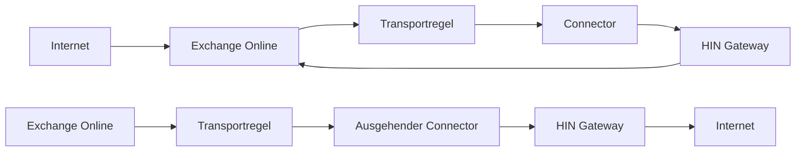

# Exchange-Integration mit HIN Gateway

Dieser Leitfaden erklärt, wie Sie Microsoft Exchange (Online und On-Premises) konfigurieren, um E-Mails über das Stargate-Gateway für S/MIME-Signatur und -Verschlüsselung zu leiten.

<!-- Interner Verweis
     Dieser Leitfaden basiert auf der Wiki-Seite [HIN Gateway mail relay setup](https://plan.vereign.com/projects/mail-gateway/wiki/stargate-mail-relay-setup) (von Zdravko Komitov). -->

{ width=32%; }
{ width=32%; }
{ width=32%; }

## Übersicht

HIN Gateway fungiert als Mail-Relay zwischen externen Mailservern und Ihrer Exchange-Umgebung. Es werden zwei Integrationsmuster unterstützt:

**Muster A – Exchange Online als primärer MX mit Transportregeln:**



**Muster B – HIN Gateway als primärer MX:**

```mermaid
flowchart LR
    I1 --> mx15 --> mx20
    EO --> TR --> OC --> HIN Gateway --> I2
    I1["Internet"]
    I2["Internet"]
    mx15["HIN Gateway (MX-Priorität 15)"]
    mx20["Exchange Online (MX-Priorität 20)"]
    EO["Exchange Online"]
    TR["Transportregel"]
    OC["Ausgehender Connector"]
    HIN Gateway
```

In beiden Mustern benötigen Sie:

1. **DNS-Einträge**, die auf den Stargate-Server verweisen
2. **Ausgehenden Connector** – leitet E-Mails von Exchange an HIN Gateway weiter
3. **Eingehenden Connector** – akzeptiert E-Mails von HIN Gateway in Exchange
4. **Transportregel** – löst den ausgehenden Connector für externe Empfänger aus

## Voraussetzungen

Stellen Sie vor der Konfiguration von Exchange Folgendes sicher:

- [X] HIN Gateway ist installiert und läuft ([Bereitstellungsanleitung](Docker-deploy.md))
- [X] Sie haben die **öffentliche IP-Adresse des Stargate-Servers** (im Folgenden als `<HIN_GATEWAY_IP>` bezeichnet)
- [X] Sie haben den **Mail-Hostnamen** des Stargate-Servers (im Folgenden als `<MAIL_HOSTNAME>` bezeichnet, z.B. `mail.example.com`)
- [X] Sie kennen Ihre **Mail-Domain** (im Folgenden als `<YOUR_DOMAIN>` bezeichnet, z.B. `example.com`)
- [X] Sie haben **Exchange-Admin**-Zugriff (Exchange Admin Center oder On-Premises Exchange Management Shell)
- [X] DNS-Einträge sind gemäß dem [DNS-Einrichtungsleitfaden](DNS-setup.md) konfiguriert (A, MX, SPF mindestens)

---

## Teil 1: DNS-Einrichtung

Siehe den [DNS-Einrichtungsleitfaden](DNS-setup.md) für vollständige Anweisungen zur Konfiguration von A-, MX-, SPF-, PTR-, DMARC- und DKIM-Einträgen.

Vor der Fortsetzung mit der untenstehenden Exchange-Konfiguration benötigen Sie mindestens:

- **A-Eintrag**: `<MAIL_HOSTNAME>` verweist auf `<HIN_GATEWAY_IP>`
- **MX-Eintrag**: `<YOUR_DOMAIN>` mit HIN Gateway bei höherer Priorität (niedrigere Zahl) als Exchange
- **SPF-Eintrag**: `ip4:<HIN_GATEWAY_IP>` und `ip4:<HIN_SEALER_IP>` wurden zum TXT-Eintrag Ihrer Domain hinzugefügt (siehe [DNS-Einrichtungsleitfaden - SPF](DNS-setup.md#spf-eintrag) für Sealer-IPs)

---

## Teil 2: Exchange Online-Konfiguration

### Schritt A: Den ausgehenden Connector erstellen (Office 365 → HIN Gateway)

Dieser Connector leitet ausgehende E-Mails von Exchange Online an den Stargate-Relay-Server weiter.

1. Navigieren Sie zum [Exchange Admin Center - Connectors](https://admin.exchange.microsoft.com/#/connectors)

2. Klicken Sie auf **"+ Connector hinzufügen"**

3. **Verbindung von**: Wählen Sie **"Office 365"**
   - **Verbindung zu**: Wählen Sie **"E-Mail-Server Ihrer Organisation"**
   - Klicken Sie auf **"Weiter"**

4. **Connectorname**: Geben Sie einen beschreibenden Namen ein, z.B.:

   ```plain
   Von Office 365 zum Stargate-Relay-Server
   ```

   - Aktivieren Sie **"Interne Exchange-E-Mail-Header beibehalten"**
   - Klicken Sie auf **"Weiter"**

5. **Verwendung des Connectors**: Wählen Sie **"Nur wenn ich eine Transportregel eingerichtet habe, die Nachrichten an diesen Connector weiterleitet"**
   - Klicken Sie auf **"Weiter"**

!!! tip
    Dies ist wichtig – der Connector leitet keine E-Mails von selbst weiter. Er wird nur verwendet, wenn er durch die in Schritt C erstellte Transportregel ausgelöst wird.

6. **Routing**: Wählen Sie **"E-Mails über diese Smart Hosts leiten"**
   - Geben Sie die Stargate-Server-IP-Adresse ein: `<STARGATE_IP>`
   - Klicken Sie auf **"+"** zum Hinzufügen und dann auf **"Weiter"**

7. **Sicherheitseinschränkungen**: Wählen Sie **"Beliebiges digitales Zertifikat, einschließlich selbstsignierter Zertifikate"**
   - Klicken Sie auf **"Weiter"**

!!! note
    Der MTA von HIN Gateway (Stalwart) akzeptiert opportunistisches TLS bei eingehenden Verbindungen. Die Auswahl von "beliebigem digitalen Zertifikat" stellt die Konnektivität auch mit selbstsignierten Zertifikaten sicher.

8. **Überprüfungs-E-Mail**: Geben Sie eine gültige E-Mail-Adresse für Ihre Domain ein (z.B. `user@<YOUR_DOMAIN>`)
   - Klicken Sie auf **"+"** und dann auf **"Überprüfen"**
   - Warten Sie, bis die Überprüfung abgeschlossen ist, und klicken Sie dann auf **"Weiter"**

!!! tip
    Damit die Überprüfung erfolgreich ist, muss der Stargate-Server laufen und E-Mails auf Port 25 annehmen.

9. Überprüfen Sie die Einstellungen und klicken Sie auf **"Connector erstellen"**

10. Klicken Sie auf dem Bestätigungsbildschirm auf **"Fertig"**

### Schritt B: Den eingehenden Connector erstellen (HIN Gateway → Office 365)

Dieser Connector akzeptiert E-Mails vom Stargate-Relay-Server in Exchange Online.

1. Klicken Sie auf der [Connectors-Seite](https://admin.exchange.microsoft.com/#/connectors) auf **"+ Connector hinzufügen"**

2. **Verbindung von**: Wählen Sie **"E-Mail-Server Ihrer Organisation"**
   - **Verbindung zu**: Zeigt **"Office 365"** an (automatisch)
   - Klicken Sie auf **"Weiter"**

3. **Connectorname**: Geben Sie einen beschreibenden Namen ein, z.B.:

   ```plain
   E-Mails vom Stargate-Relay-Server empfangen
   ```

   - Aktivieren Sie **"Interne Exchange-E-Mail-Header beibehalten"**
   - Klicken Sie auf **"Weiter"**

4. **Authentifizierung gesendeter E-Mails**: Wählen Sie **"Durch Überprüfen, ob die IP-Adresse des sendenden Servers mit einer der folgenden IP-Adressen übereinstimmt, die ausschließlich Ihrer Organisation gehören"**
   - Geben Sie die Stargate-Server-IP-Adresse ein: `<HIN_GATEWAY_IP>`
   - Klicken Sie auf **"+"** zum Hinzufügen und dann auf **"Weiter"**

!!! note
    Dies teilt Exchange Online mit, dass E-Mails von dieser spezifischen IP-Adresse vertrauenswürdig sind, und umgeht zusätzliche Spam-/Authentifizierungsprüfungen für E-Mails, die bereits von HIN Gateway verarbeitet wurden.

5. Überprüfen Sie die Einstellungen und klicken Sie auf **"Connector erstellen"**

6. Klicken Sie auf **"Fertig"**

### Connectors überprüfen

Nach der Erstellung beider Connectors sollte die Connectors-Seite Folgendes anzeigen:

| Status | Name | Von | An |
| -------- | ------ | ------ | ----- |
| Ein | E-Mails vom Stargate-Relay-Server empfangen | Ihre Org | O365 |
| Ein | Von Office 365 zum Stargate-Relay-Server | O365 | Ihre Org |

### Schritt C: Die Transportregel erstellen

Die Transportregel leitet alle ausgehenden E-Mails über den Stargate-Ausgangs-Connector weiter, mit Ausnahme von E-Mails, die von HIN Gateway selbst stammen (um E-Mail-Schleifen zu vermeiden).

1. Navigieren Sie zum [Exchange Admin Center - Regeln](https://admin.exchange.microsoft.com/#/transportrules)

2. Klicken Sie auf **"+ Regel hinzufügen"** → **"Neue Regel erstellen"**

3. **Regelname**: Geben Sie einen beschreibenden Namen ein, z.B.:

   ```plain
   Alle E-Mails an HIN Gateway weiterleiten, außer E-Mails von diesem
   ```

4. **Diese Regel anwenden, wenn**: Wählen Sie **"Der Empfänger..."** → **"ist extern/intern"** → **"Außerhalb der Organisation"**
   - Klicken Sie auf **"Speichern"**

!!! note
    Diese Bedingung stellt sicher, dass nur ausgehende E-Mails (an externe Empfänger) über HIN Gateway weitergeleitet werden.

5. **Folgendes tun**: Wählen Sie **"Die Nachricht umleiten an..."** → **"den folgenden Connector"** → wählen Sie den in Schritt A erstellten ausgehenden Connector (z.B. "Von Office 365 zum Stargate-Relay-Server")
   - Klicken Sie auf **"Speichern"**

6. **Außer wenn**: Klicken Sie auf **"+"**, um eine Ausnahme hinzuzufügen
   - Wählen Sie **"Der Absender..."** → **"IP-Adresse in einem dieser Bereiche"**
   - Geben Sie die Stargate-Server-IP-Adresse ein: `<HIN_GATEWAY_IP>`
   - Klicken Sie auf **"Hinzufügen"**, überprüfen Sie, ob die IP aufgeführt ist, und klicken Sie dann auf **"Speichern"**

!!! warning
    **Diese Ausnahme ist kritisch** – sie verhindert E-Mail-Schleifen. Ohne sie würden E-Mails von HIN Gateway, die bei Exchange Online ankommen, in einer Endlosschleife zurück an HIN Gateway weitergeleitet.

7. Überprüfen Sie die Regelzusammenfassung. Sie sollte Folgendes anzeigen:
   - **Diese Regel anwenden, wenn**: Der Empfänger befindet sich Außerhalb der Organisation
   - **Folgendes tun**: Die Nachricht an den Connector "Von Office 365 zum Stargate-Relay-Server" umleiten
   - **Außer wenn**: Die Absender-IP-Adresse in einem dieser Bereiche liegt: `<HIN_GATEWAY_IP>`

8. Klicken Sie auf **"Weiter"**, dann erneut auf **"Weiter"**, dann auf **"Fertig"** und dann auf **"Fertig"**

9. **Regel aktivieren**: Die Regel wird im deaktivierten Zustand erstellt. Klicken Sie auf die Regel in der Liste und schalten Sie **"Regel aktivieren oder deaktivieren"** auf **"Aktiviert"** um.

!!! tip
    Vergessen Sie nicht, die Regel zu aktivieren – sie funktioniert nicht, bis sie aktiviert ist.

---

## Teil 3: Konfiguration des On-Premises Exchange-Servers

Für On-Premises Exchange Server (2016, 2019) ist die Einrichtung ähnlich, wird jedoch über die Exchange-Verwaltungskonsole (EAC) oder die Exchange-Verwaltungsshell (PowerShell) konfiguriert.

### Send Connector (On-Premises → HIN Gateway)

Erstellen Sie einen Send-Connector, um ausgehende E-Mails über HIN Gateway zu leiten:

**Exchange-Verwaltungsshell (PowerShell):**

```powershell
New-SendConnector -Name "To HIN Gateway Relay" `
  -AddressSpaces "SMTP:*;1" `
  -SmartHosts "<HIN_GATEWAY_IP>" `
  -SmartHostAuthMechanism None `
  -DNSRoutingEnabled $false `
  -SourceTransportServers "<YOUR_EXCHANGE_SERVER>"
```

**Exchange Admin Center (GUI):**

1. Navigieren Sie zu **Mailfluss** → **Send-Connectors**
2. Klicken Sie auf **+**, um einen neuen Connector zu erstellen
3. **Name**: "To HIN Gateway Relay"
4. **Typ**: Wählen Sie **"Internet"**
5. **Netzwerkeinstellungen**: Wählen Sie **"E-Mails über Smart Hosts leiten"**, fügen Sie `<HIN_GATEWAY_IP>` hinzu
6. **Smart Host-Authentifizierung**: Wählen Sie **"Keine"**
7. **Adressraum**: Fügen Sie `*` (alle Domains) oder bestimmte externe Domains hinzu
8. **Quellserver**: Wählen Sie Ihre Exchange-Transportserver

### Receive Connector (HIN Gateway → On-Premises)

Erstellen oder ändern Sie einen Receive-Connector, um E-Mails von HIN Gateway zu akzeptieren:

**Exchange-Verwaltungsshell (PowerShell):**

```powershell
New-ReceiveConnector -Name "From HIN Gateway Relay" `
  -Bindings "0.0.0.0:25" `
  -RemoteIPRanges "<HIN_GATEWAY_IP>" `
  -TransportRole FrontendTransport `
  -Usage Custom `
  -AuthMechanism ExternalAuthoritative `
  -PermissionGroups ExchangeServers
```

**Exchange Admin Center (GUI):**

1. Navigieren Sie zu **Mailfluss** → **Receive-Connectors**
2. Klicken Sie auf **+**, um einen neuen Connector zu erstellen
3. **Name**: "From HIN Gateway Relay"
4. **Typ**: Wählen Sie **"Frontend Transport"**
5. **Netzwerkadapterbindungen**: Standard belassen oder an bestimmte IP binden
6. **Remote-Netzwerkeinstellungen**: Entfernen Sie den Standardbereich `0.0.0.0-255.255.255.255` und fügen Sie nur `<HIN_GATEWAY_IP>` hinzu
7. **Authentifizierung**: Aktivieren Sie **"Extern gesichert"**
8. **Berechtigungsgruppen**: Aktivieren Sie **"Exchange-Server"**

### Transportregel (On-Premises)

Erstellen Sie eine Transportregel, um ausgehende E-Mails über den Send-Connector weiterzuleiten:

**Exchange-Verwaltungsshell (PowerShell):**

```powershell
New-TransportRule -Name "Relay outbound via HIN Gateway" `
  -SentToScope NotInOrganization `
  -RouteMessageOutboundConnector "To HIN Gateway Relay" `
  -ExceptIfSenderIpRanges "<HIN_GATEWAY_IP>"
```

**Exchange Admin Center (GUI):**

1. Navigieren Sie zu **Mailfluss** → **Regeln**
2. Klicken Sie auf **+** → **"Neue Regel erstellen"**
3. **Name**: "Relay outbound via HIN Gateway"
4. **Diese Regel anwenden, wenn**: "Der Empfänger befindet sich..." → "Außerhalb der Organisation"
5. **Folgendes tun**: "Die Nachricht umleiten an..." → "den folgenden Connector" → "To HIN Gateway Relay"
6. **Außer wenn**: "Die Absender-IP-Adresse in..." → fügen Sie `<HIN_GATEWAY_IP>` hinzu

---

## Teil 4: Stargate-seitige Konfiguration

### Automatische Konfiguration (Standard)

Standardmäßig ermittelt Stalwart automatisch, wohin verarbeitete E-Mails zugestellt werden sollen, indem es die MX-Einträge für jede über die `/mail`-Seite des Dashboards konfigurierte Domain nachschlägt. Es filtert seinen eigenen Hostnamen heraus und verwendet die verbleibenden MX-Einträge als Zustellziele.

Dies funktioniert, wenn:

- Ihre Domain MX-Einträge hat, die sowohl auf HIN Gateway als auch auf Exchange verweisen
- HIN Gateway einen MX-Eintrag mit höherer Priorität (niedrigere Zahl) als Exchange hat

### Manuelle Überschreibung über das Dashboard

Wenn Sie alle ausgehenden E-Mails von HIN Gateway an einen einzigen Exchange-Endpunkt senden möchten (z.B. Exchange Online Protection), setzen Sie den Relay-Host über die `/mail`-Seite des Dashboards (z.B. `[smtp.office365.com]`). Das Dashboard sendet den Wert an die REST-API von mtaconf und der Daemon wendet ihn auf Stalwart an.

!!! note
    Ein einzelner Relay-Host sendet alle E-Mails über einen Server und unterstützt kein pro-Domain-Routing. Für mehrere Domains, die über verschiedene Exchange-Server geroutet werden, verwenden Sie die pro-Domain-Relay-Map auf derselben Dashboard-Seite (konfiguriert intern `sender_dependent_relayhost_maps`) – siehe [Multi-Domain-Setup](#multi-domain-setup) unten.

### Multi-Domain-Setup

Für Setups mit mehreren Domains und verschiedenen Exchange-Servern (z.B. BALZ Informatik AG mit 26 Domains) verwenden Sie MX-Einträge für das pro-Domain-Routing:

```plain
domain1.com    MX 10  exchange1.domain1.com
domain1.com    MX 20  stargate.domain1.com

domain2.com    MX 10  exchange2.domain2.com
domain2.com    MX 20  stargate.domain2.com
```

Die MX-Einträge jeder Domain sagen HIN Gateway, wohin verarbeitete E-Mails für diese spezifische Domain zugestellt werden sollen.

### Stargate-Konfiguration überprüfen

Überprüfen Sie nach der Einrichtung die Stalwart-Konfiguration:

#### Relay-Konfiguration prüfen

```bash
docker logs stargate-stalwart --tail 50 | grep -i relay
```

#### Mail-Warteschlange prüfen (sollte leer sein, wenn alles funktioniert)

```bash
docker exec stargate-stalwart stalwart-cli -u http://localhost:8080 queue list
```

#### Test-E-Mail senden und Logs prüfen

```bash
docker logs stargate-stalwart --tail 50
```

## Fehlerbehebung

### E-Mails verlassen Exchange Online nicht

- Überprüfen Sie, ob die Transportregel **aktiviert** ist (sie wird im deaktivierten Zustand erstellt)
- Überprüfen Sie die Regelbedingungen – sie sollte für Empfänger "Außerhalb der Organisation" gelten
- Überprüfen Sie, ob die Validierung des ausgehenden Connectors bestanden wurde
- Überprüfen Sie die Exchange-Nachrichtenverfolgung im Admin Center auf den Zustellungsstatus

### E-Mail-Schleifen (doppelte Nachrichten)

- Stellen Sie sicher, dass die Transportregel die **Ausnahme** für die Stargate-IP-Adresse hat
- Ohne diese Ausnahme werden E-Mails von HIN Gateway, die bei Exchange ankommen, zurück an HIN Gateway weitergeleitet

### HIN Gateway akzeptiert keine E-Mails von Exchange

- Überprüfen Sie, ob Port 25 in der Firewall des Stargate-Servers geöffnet ist
- Überprüfen Sie, ob der SPF-Eintrag die Stargate-IP enthält
- Überprüfen Sie die Stalwart-Logs: `docker logs stargate-stalwart`

### Exchange Online lehnt E-Mails von HIN Gateway ab

- Überprüfen Sie, ob der eingehende Connector mit der richtigen Stargate-IP konfiguriert ist
- Überprüfen Sie, ob sich die Stargate-IP nicht geändert hat
- Überprüfen Sie, ob der Connector aktiviert ist (Status: Ein)

### TLS-Zertifikatsfehler

HIN Gateway verwendet opportunistisches TLS mit einem selbstsignierten Zertifikat. Der ausgehende Connector in Exchange sollte so konfiguriert sein, dass er "Beliebige digitale Zertifikate, einschließlich selbstsignierter Zertifikate" akzeptiert. Wenn Sie TLS-bezogene Fehler sehen:

- Überprüfen Sie, ob die Sicherheitseinstellung des ausgehenden Connectors selbstsignierte Zertifikate erlaubt
- Stellen Sie für On-Premises Exchange sicher, dass der Send-Connector kein TLS erfordert (`-RequireTLS $false`)

### Validierung schlägt bei der Connector-Erstellung fehl

Die Validierung des ausgehenden Connectors erfordert:

- Stargate-Server läuft und akzeptiert Verbindungen auf Port 25
- Die Validierungs-E-Mail-Adresse ist für Ihre Domain gültig
- Der Netzwerkpfad zwischen Exchange Online und HIN Gateway ist offen (keine Firewall-Blockierung)

---

## Kurzreferenz

| Komponente | Exchange Online-Ort | Zweck |
| ----------- | -------------------------- | --------- |
| Ausgehender Connector | Admin Center → Mailfluss → Connectors | Ausgehende E-Mails an HIN Gateway leiten |
| Eingehender Connector | Admin Center → Mailfluss → Connectors | E-Mails von HIN Gateway akzeptieren |
| Transportregel | Admin Center → Mailfluss → Regeln | Ausgehenden Connector für externe Empfänger auslösen |

| DNS-Eintrag | Beispiel | Zweck |
| ------------ | --------- | --------- |
| A | `mail IN A <HIN_GATEWAY_IP>` | Hostnamen auf HIN Gateway verweisen |
| MX (HIN Gateway) | `@ IN MX 15 mail.<YOUR_DOMAIN>.` | Eingehende E-Mails treffen zuerst auf HIN Gateway |
| MX (Exchange) | `@ IN MX 20 <DOMAIN>.mail.protection.outlook.com.` | Fallback / Zustellziel |
| SPF | `ip4:<HIN_GATEWAY_IP>` und `ip4:<HIN_SEALER_IP>` zum vorhandenen TXT-Eintrag hinzugefügt | HIN Gateway und HIN-Sealer autorisieren, E-Mails zu senden |

Die vollständige DNS-Einrichtung (einschließlich PTR, DMARC, DKIM und Multi-Domain) finden Sie im [DNS-Einrichtungsleitfaden](DNS-setup.md).
