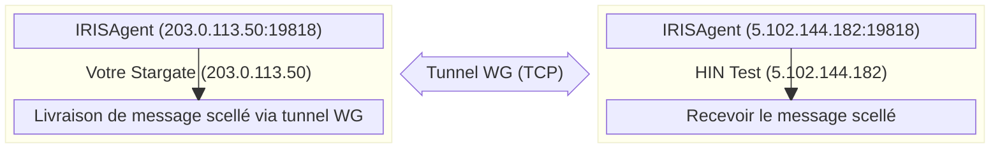
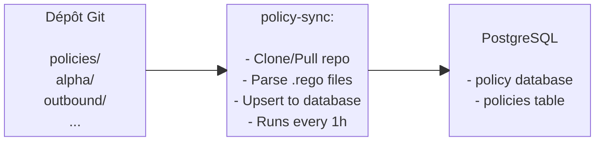

# Configuration avancée de Stargate Docker

## Sauvegardes

### Sauvegardes automatiques

* Les sauvegardes quotidiennes s'exécutent à 2h00 via cron (configurées lors de l'installation)
* Les sauvegardes sont stockées dans `./backups/` sous forme de fichiers `.tar.gz` horodatés
* Les anciennes sauvegardes (>7 jours) sont automatiquement nettoyées

### Ce qui est inclus dans les sauvegardes

* **Dump PostgreSQL complet** (toutes les bases de données avec utilisateurs et permissions)
* **Dumps de bases de données individuelles** (pour une restauration partielle si nécessaire)
* **Clés Vault** (`vault-keys.json` pour le descellage)
* **Configuration client** (`customer-config.sh` avec la clé WireGuard)
* **CSR et certificats S/MIME** (tous les fichiers `.crt`, `.pem`, `.cer`)
* **Manifeste de sauvegarde** (`manifest.json` avec métadonnées)

### Sauvegarde manuelle

```bash
./scripts/backup.sh
```

Crée une archive compressée dans `./backups/YYYYMMDD_HHMMSS.tar.gz`.

### Restauration à partir d'une sauvegarde

Pour restaurer sur une **nouvelle machine** ou après une **purge**. Copiez l'archive de sauvegarde sur la nouvelle machine et exécutez:

```bash
./scripts/restore.sh backups/20260130_143022.tar.gz
```

Le script de restauration va:

1. Arrêter tous les services en cours d'exécution
2. Extraire et valider la sauvegarde
3. Installer Docker si nécessaire
4. Restaurer la configuration client
5. Démarrer les services d'infrastructure (PostgreSQL, Vault, MinIO)
6. Restaurer la base de données
7. Desceller Vault avec les clés sauvegardées
8. Démarrer les services d'application

### Restauration partielle (base de données unique)

Si vous avez seulement besoin de restaurer une base de données:

#### Extraire la sauvegarde

```bash
tar -xzf backups/20260130_143022.tar.gz -C /tmp/
```

#### Restaurer une base de données spécifique

```bash
cat /tmp/20260130_143022/database/mxengine.sql | docker exec -i stargate-postgres psql -U postgres -d mxengine
```

## Mise à jour de Stargate

### Mettre à jour les scripts de déploiement et la configuration

Le dépôt de déploiement Stargate reçoit des mises à jour des scripts (`install.sh`, `start.sh`, `health-check.sh`, `restore.sh`, etc.), des modèles de configuration et de la documentation. Pour appliquer ces mises à jour:

#### 1. Créez une sauvegarde avant la mise à jour

```bash
./scripts/backup.sh
```

#### 2. Récupérez et appliquez les dernières modifications

Le dépôt est la source unique de vérité pour les fichiers suivis. Mettez donc à jour en réinitialisant sur la dernière révision. Cela remplace les fichiers suivis (scripts, `docker-compose.yml`, modèles de configuration) par les versions du dépôt:

```bash
git fetch origin
git reset --hard origin/main
```

#### 3. Redémarrez les services pour prendre en compte les modifications de scripts ou de configuration

```bash
./scripts/stop.sh
./scripts/start.sh
```

!!! note
    Votre `customer-config.sh`, `.env` et le répertoire `secrets/` sont dans `.gitignore`, donc cette opération n'y touche **pas** - votre configuration et vos identifiants sont préservés. Effectuez toujours vos personnalisations dans `customer-config.sh`, jamais en modifiant des fichiers suivis comme `docker-compose.yml`: une réinitialisation matérielle - et les mises à jour automatiques déclenchées depuis le tableau de bord - annulera toute modification des fichiers suivis. C'est intentionnel; le fait que chaque déploiement reste identique au dépôt est ce qui permet aux mises à jour de s'appliquer de manière fiable et sans résolution manuelle de conflits.

Si la mise à jour inclut des modifications du modèle de configuration, comparez-le avec votre configuration existante pour voir si de nouvelles variables ont été ajoutées:

```bash
diff customer-config.sh customer-config-prod.example.sh
```

### Mettre à jour les images des services

Les versions des applications sont gérées **exclusivement via le tableau de bord**. Chaque version est un *manifeste* versionné qui fige ensemble une combinaison connue et testée de toutes les versions de services; la page de mise à jour du tableau de bord liste les versions disponibles, et l'application de l'une d'elles récupère les images correspondantes et recrée les services concernés pour vous.

Pour mettre à jour:

1. Ouvrez le tableau de bord et accédez à la page de mise à jour.
2. Sélectionnez la version cible.
3. Confirmez - le tableau de bord applique le manifeste de version et recrée les services modifiés.

!!! warning "Ne changez pas les versions à la main"
    Ne modifiez pas les valeurs `*_VERSION` individuelles dans `customer-config.sh` ou `.env` pour mettre à jour les applications. Les versions sont publiées et testées ensemble en tant qu'ensemble - en choisir une à la main produit une combinaison non testée, et la modification serait de toute façon annulée par la prochaine mise à jour du tableau de bord. Mettez toujours à jour depuis le tableau de bord.

#### Nettoyer les anciennes images

Après les mises à jour, supprimez les images inutilisées pour libérer de l'espace disque:

```bash
docker image prune -f
```

#### Retour arrière

Pour effectuer un retour arrière, sélectionnez une version antérieure sur la page de mise à jour du tableau de bord et appliquez-la - le même mécanisme s'exécute en sens inverse et fige l'ensemble testé précédent. N'effectuez pas de retour arrière en modifiant les versions à la main.

## Configuration

Le fichier `.env` est généré par `install.sh` à partir de `customer-config.sh`. Les paramètres de domaine, de certificat et de WireGuard sont gérés à l'exécution par le tableau de bord (`/installation`, `/onboarding`, `/mail`) — ils ne sont pas conservés dans `.env`. Pour personnaliser les paramètres d'installation, modifiez `customer-config.sh` et réexécutez `install.sh`.

Sections clés dans le `.env` généré:

```bash
## PostgreSQL (auto-généré si vide dans customer-config.sh)
POSTGRES_USER=postgres
POSTGRES_PASSWORD=<auto-généré>

## Vault (auto-rempli après initialisation)
VAULT_TOKEN=<auto-généré>

## Stockage d'objets S3 (SeaweedFS)
S3_ACCESS_KEY=minioadmin
S3_SECRET_KEY=<auto-généré>

## Versions des applications
SMIMEKEYS_VERSION=v0.0.5
POLICY_VERSION=v0.0.5
IRISAGENT_VERSION=v0.0.6-branch
MXENGINE_VERSION=v0.0.35
MTACONF_VERSION=dev

## Chemin de courrier sortant
MXENGINE_PUBLIC_ADDRESS=http://203.0.113.50:8084
OUTBOUND_SEALER_MX_DOMAIN=hintest.ch

## WireGuard
WG_LOCAL_IP=203.0.113.50
WG_INTERFACE_PORT=19818
WG_TRANSPORT_MODE=tcp
```

!!! warning
    **Ne modifiez pas `.env` directement.** Les modifications seront écrasées lors de la réexécution de `install.sh`. Pour la configuration d'exécution (domaines, nom d'hôte, pairs, S/MIME), utilisez le tableau de bord.

## URLs des services

| Service | URL/Port |
|---------|----------|
| Tableau de bord | <https://localhost> |
| smimekeys-client | <http://localhost:8081> |
| policy | <http://localhost:8082> |
| irisagent | <http://localhost:8083> |
| mxengine HTTP | <http://localhost:8084> |
| Stalwart SMTP | localhost:25 |
| Passerelle APISIX | <http://localhost:9080> |
| Keycloak | <https://localhost:8180> |

## Contrôles de santé

Tous les services exposent un point de terminaison `/liveness`:

```bash
curl http://localhost:8081/liveness  # smimekeys-client
curl http://localhost:8082/liveness  # policy
curl http://localhost:8083/liveness  # irisagent
curl http://localhost:8084/liveness  # mxengine
```

## Surveillance

### Métriques Prometheus

Tous les services d'application exposent des métriques Prometheus sur le port 2112 (en interne), mappés à différents ports hôtes:

| Service | Port des métriques | URL des métriques |
|---------|--------------|-------------|
| smimekeys-client | `2113` | <http://localhost:2113/metrics> |
| irisagent | `2114` | <http://localhost:2114/metrics> |
| policy | `2115` | <http://localhost:2115/metrics> |
| mxengine | `2116` | <http://localhost:2116/metrics> |
| node-exporter | `9100` | <http://localhost:9100/metrics> |

### Exemple de configuration de récupération Prometheus

```yaml
scrape_configs:
  - job_name: 'stargate-smimekeys'
    static_configs:
      - targets: ['<hôte>:2113']
  - job_name: 'stargate-irisagent'
    static_configs:
      - targets: ['<hôte>:2114']
  - job_name: 'stargate-policy'
    static_configs:
      - targets: ['<hôte>:2115']
  - job_name: 'stargate-mxengine'
    static_configs:
      - targets: ['<hôte>:2116']
  - job_name: 'stargate-node'
    static_configs:
      - targets: ['<hôte>:9100']
```

### Vérification rapide des métriques

```bash
## Vérifier tous les points de terminaison de métriques
curl -s http://localhost:2113/metrics | head -20  # smimekeys-client
curl -s http://localhost:2114/metrics | head -20  # irisagent
curl -s http://localhost:2115/metrics | head -20  # policy
curl -s http://localhost:2116/metrics | head -20  # mxengine
curl -s http://localhost:9100/metrics | head -20  # node-exporter
```

### Collecte de logs (Alloy → Loki)

Alloy collecte les logs des conteneurs d'application et les envoie à Loki.

**Conteneurs surveillés:**

* stargate-apisix
* stargate-keycloak
* stargate-dashboard
* stargate-smimekeys-client
* stargate-policy
* stargate-policy-sync
* stargate-irisagent
* stargate-mxengine

**Configuration** dans `.env`:

```env
## URL de poussée Loki
LOKI_URL=https://loki.example.com

## Étiquette de nom d'hôte pour les logs (auto-définie sur DEPLOYMENT_NAME)
ALLOY_HOSTNAME=stargate-acme
```

**Étiquettes ajoutées aux logs:**

* `environment=<DEPLOYMENT_NAME>` - Identifie le déploiement
* `host=<ALLOY_HOSTNAME>` - Identifie l'hôte (identique au nom du déploiement)
* `container=<nom-conteneur>` - Nom du conteneur
* `service=<nom-service>` - Nom du service (ex., smimekeys-client, policy)
* `level=<niveau-log>` - Extrait des logs JSON si disponible

**Interroger les logs dans Grafana:**

```logql
{environment="stargate-acme"} |= "error"
{environment="stargate-acme", service="mxengine"}
{environment="stargate-acme", level="error"}
```

**Vérifier qu'Alloy fonctionne:**

=== "Vérifier l'état d'Alloy et l'activité récente"

    ```bash
    docker logs stargate-alloy
    ```

=== "Sonde de santé (depuis le réseau Docker)"

    ```bash
    docker exec stargate-alloy wget -qO- http://localhost:12345/-/ready
    ```

**Remarque:** L'IP publique de la VM doit être autorisée dans la configuration d'entrée de Loki.

## Stalwart MTA + mtaconf

Stargate utilise **Stalwart** comme agent de transfert de courrier et **mtaconf** comme démon de configuration. Le tableau de bord envoie la configuration des domaines et du relais à l'API REST de mtaconf, qui la transmet à Stalwart via l'interface de ligne de commande de gestion.

### Architecture du flux de courrier

```plain
Serveur de courrier externe
         │
         ▼ (port 25)
┌─────────────────────────────────────────────────────┐
│ stalwart (stargate-stalwart)                        │
│                                                     │
│  Port 25 (écouteur smtp)                            │
│    │                                                │
│    ▼                                                │
│  content_filter → smtp:[mxengine]:1587              │
│    │                                                │
└────┼────────────────────────────────────────────────┘
     │
     ▼ (port 1587)
┌─────────────────────────────────────────────────────┐
│ MXEngine (stargate-mxengine)                        │
│                                                     │
│  Port 1587 (entrée SMTP)                             │
│    │                                                │
│    ▼                                                │
│  Signer/chiffrer/traiter le courrier                │
│    │                                                │
│    ▼                                                │
│  Livrer à stalwart pour relais                      │
│    │                                                │
└────┼────────────────────────────────────────────────┘
     │
     ▼ (port 10026)
┌─────────────────────────────────────────────────────┐
│ stalwart (stargate-stalwart)                        │
│                                                     │
│  Port 10026 (écouteur de réinjection)               │
│    │                                                │
│    ▼                                                │
│  transport → relais vers le MX de destination       │
│    │                                                │
└────┼────────────────────────────────────────────────┘
     │
     ▼ (port 25)
Serveur de courrier de destination (via recherche MX)
```

**Analyse antivirus:** Les courriels entrants sont analysés par **ClamAV** (`stargate-clamav`), intégré à Stalwart comme milter au stade SMTP DATA sur les écouteurs public (`:25`) et de réinjection (`:10026`). Les courriels infectés sont rejetés au niveau SMTP ; si ClamAV est inaccessible, le message est différé plutôt que livré non analysé (échec-fermé). La base de données de signatures de ClamAV réside dans le volume `clamav_data` et est maintenue à jour par freshclam en arrière-plan.

**Flux de rappel de scellement (entrant):** Lorsqu'un scelleur distant doit livrer un message scellé, il appelle `MXENGINE_PUBLIC_ADDRESS` (par défaut: `http://<SERVER_STATIC_IP>:8084`). Le protocole `http://` est correct - TLS n'est pas requis car la charge utile du sceau est déjà chiffrée.

### Configuration du relais de courrier

Toute la configuration de courrier qui varie par déploiement (domaines de courrier, nom d'hôte, hôte de relais, cartes de relais par domaine, réseaux autorisés) est définie via la **page `/mail` du tableau de bord** à l'exécution. Le tableau de bord envoie la configuration à l'API REST de mtaconf, qui l'applique à Stalwart sans redémarrer le conteneur.

Il n'y a pas de configuration par domaine dans `customer-config.sh` ou `.env` - les opérateurs ajoutent ou modifient les domaines via l'interface utilisateur.

### Routage du courrier (migration depuis l'ancien MGW)

!!! tip "Différence clé avec l'ancien HIN-MGW"
    Dans l'ancien MGW, vous deviez configurer manuellement un serveur cible par domaine. Dans Stargate, le routage du courrier est décidé par **les enregistrements MX DNS par défaut** - Stalwart résout le MX de chaque domaine au moment de la livraison. La page `/mail` du tableau de bord vous permet de remplacer cela par domaine (ex. pour relayer via votre locataire M365 / Exchange) sans toucher au DNS.

**Par défaut - automatique via DNS MX:**

Pour chacun de vos domaines, assurez-vous qu'il y a un enregistrement MX dans le DNS pointant vers le serveur Exchange (ou autre serveur de courrier) correspondant:

```plain
domain1.com    MX 10  exchange1.domain1.com
domain2.com    MX 10  exchange2.domain2.com
domain3.com    MX 10  exchange3.domain3.com
```

Cela fonctionne pour n'importe quel nombre de domaines - chaque domaine peut pointer vers un serveur de courrier différent, et Stalwart acheminera en conséquence.

**Si Stargate est le seul enregistrement MX** pour un domaine, Stalwart le filtrera et n'aura pas de cible de livraison. Ajoutez un deuxième enregistrement MX pointant vers votre serveur de courrier avec une priorité plus élevée (= nombre inférieur) pour que Stalwart l'utilise comme cible de livraison:

```plain
example.com    MX 10  exchange.example.com      ← cible de livraison (serveur de courrier)
example.com    MX 20  stargate.example.com      ← passerelle entrante (Stargate)
```

**Alternative - relais explicite par domaine (basé sur l'expéditeur):**

Pour le relais de retour via M365 / Exchange Online, configurez les cibles de relais par domaine via la page `/mail` du tableau de bord. Les courriels des expéditeurs non présents dans la carte reviennent à la recherche MX.

### Ports

| Port | Objectif |
|------|---------|
| `25` | Écouteur SMTP principal (connexions externes) |
| `10026` | Port de réinjection (mxengine → stalwart, interne uniquement) |
| `1587` | Entrée SMTP de MXEngine (stalwart → mxengine, interne uniquement) |
| `8080` | API de gestion Stalwart + API REST mtaconf (interne uniquement) |

!!! question "Vous utilisez Exchange ?"
    Voir [Exchange-integration](Exchange-integration.md) pour la configuration complète des connecteurs et des règles de transport Exchange Online / On-Premises.

### Vérification

Vérifier l'état de Stalwart

```bash
docker exec stargate-stalwart stalwart-cli -u http://localhost:8080 server list-listeners
```

Vérifier les logs

```bash
docker logs stargate-stalwart
```

Tester la connexion au port 25

```bash
telnet localhost 25
```

Tester le port interne 10026 (depuis le conteneur mxengine)

```bash
docker exec stargate-mxengine nc -zv stalwart 10026
```

### Mise à jour de l'image mtaconf

Comme tout service, la version de l'image mtaconf fait partie d'une version et se met à jour via le tableau de bord - pas en modifiant son tag à la main. Sélectionnez la version cible sur la page de mise à jour du tableau de bord pour l'appliquer.

### Dépannage de Stargate

**Courrier non traité par mxengine**:

* Vérifiez que content_filter est configuré: vérifiez que les logs mtaconf montrent une poussée réussie
* Vérifiez que mxengine est accessible: `docker exec stargate-stalwart nc -zv mxengine 1587`

**Courrier bloqué après le traitement par mxengine**:

* Vérifiez la configuration sortante de mxengine: OUTBOUND_SMTP_HOST=stalwart, OUTBOUND_SMTP_PORT=10026
* Vérifiez que l'écouteur du port 10026 est actif dans Stalwart
* Vérifiez que les réseaux de relais autorisés incluent le réseau Docker (172.x.x.x/16)

**Erreurs de liste grise (450 4.7.1)**:

* C'est normal ! Le serveur de destination rejette temporairement le courrier
* Stalwart réessaie automatiquement après un délai configurable
* Vérifiez la file d'attente via l'API de gestion

**Microsoft bloque l'IP (S3140)**:

* L'IP de votre serveur a une mauvaise réputation auprès de Microsoft
* Demandez la suppression de liste sur: <https://sender.office.com>
* Peut prendre 24 à 48 heures pour prendre effet

**Échecs de recherche DNS**:

* Utilisez la page `/mail` du tableau de bord pour définir un hôte de relais explicite ou une carte de relais par domaine (contourne la découverte basée sur MX)

**Connexion refusée sur le port 25**:

* Assurez-vous que le port 25 n'est pas bloqué par le pare-feu
* Vérifiez si un autre service utilise le port 25: `ss -tlnp | grep:25`

## WireGuard (Communication Agent-à-Agent)

IRISAgent utilise WireGuard pour établir des tunnels cryptés sécurisés entre les instances Stargate pour la livraison de messages scellés.

### Comment cela fonctionne

Chaque instance Stargate utilise l'IP publique statique réelle de son serveur comme adresse de tunnel WireGuard. Cela garantit l'unicité entre tous les déploiements sans coordination manuelle.



### Configuration WireGuard

Paramètres WireGuard dans `customer-config.sh`:

```bash
## ==============================================================================
## IP du serveur — utilisée comme adresse de tunnel WireGuard et URL de rappel MXEngine
## ==============================================================================
SERVER_STATIC_IP="203.0.113.50"       # L'IP publique statique réelle de votre serveur

## ==============================================================================
## Paramètres locaux WireGuard (généralement laissés par défaut)
## ==============================================================================
WG_PRIVATE_KEY=""                     # Auto-généré par IRISAgent, puis sauvegardé dans la configuration
WG_INTERFACE_PORT="19818"             # Port WireGuard par défaut
WG_TRANSPORT_MODE="tcp"               # "tcp" (par défaut) ou "udp"

```

!!! info
    **`WG_LOCAL_IP`** est auto-dérivé de `SERVER_STATIC_IP`. Vous n'avez pas besoin de le définir séparément.

### Configuration de la connexion pair

Les détails du pair WireGuard (clé publique, point de terminaison, IP autorisées, etc.) sont configurés à l'exécution via la page `/installation` du tableau de bord. Il n'y a plus de bloc `WG_PEER_*` dans `customer-config.sh` — le pair est configuré après le démarrage de la pile.

Pour la première configuration avec l'environnement HIN Test:

1. Démarrez la pile avec `./scripts/install.sh`.
2. Ouvrez le tableau de bord, suivez `/installation` pour démarrer la négociation nonce / HIN.
3. Ouvrez les logs IRISAgent (`docker compose logs irisagent`) et copiez la ligne `wireguard public key:`. Envoyez-la avec `DEPLOYMENT_NAME` et `SERVER_STATIC_IP` à Vereign (<kalin.canov@vereign.com>) afin qu'ils puissent enregistrer votre pair côté CA.
4. Après la confirmation de l'enregistrement par Vereign, terminez `/onboarding` dans le tableau de bord pour émettre le certificat S/MIME.

Pour tout **pair supplémentaire** (pair-à-pair entre deux Stargates), échangez les clés publiques + points de terminaison avec l'autre partie et ajoutez la connexion via l'API IRISAgent:

```bash
curl --location 'localhost:8083/v1/connections' \
--header 'Content-Type: application/json' \
--header 'Accept: application/json' \
--data '{
  "allowedIps": "<IP du nouveau pair>/32",
  "description": "<courte description>",
  "endpoint": "<IP du nouveau pair>:19818",
  "externalId": [
    "<domaine du nouveau pair>"
  ],
  "name": "<Nom du nouveau pair>",
  "presharedKey": "",
  "publicKey": "<clé publique du nouveau pair>",
  "status": "completed",
  "transport": "tcp",
  "wireguardIp": "<IP du nouveau pair>",
  "wireguardPort": 10080
}'
```

### Vérification WireGuard

Vérifier l'interface WireGuard d'IRISAgent

```bash
docker exec stargate-irisagent wg show
```

Vérifier la connexion dans la base de données

```bash
docker exec stargate-postgres psql -U postgres -d irisagent \
  -c "SELECT connection_id, name, endpoint, wireguard_ip, transport, status FROM connections;"
```

Vérifier les identifiants externes de connexion (utilisés pour le routage)

```bash
docker exec stargate-postgres psql -U postgres -d irisagent \
  -c "SELECT connection_id, external_id FROM connection_external_ids;"
```

Tester la connectivité WireGuard (vérifier l'état du tunnel depuis l'hôte)

```bash
docker logs stargate-irisagent 2>&1 | grep -i "handshake\|peer.*added\|started listening"
```

Vérifier les logs IRISAgent pour l'activité du tunnel

```bash
docker logs stargate-irisagent | grep -i wireguard
```

### Dépannage WireGuard

**Pas d'interface WireGuard:**

* Vérifiez les logs IRISAgent: `docker logs stargate-irisagent`
* Vérifiez que `WG_LOCAL_IP` est défini dans `.env` (auto-dérivé de `SERVER_STATIC_IP` — devrait être l'IP publique statique de ce serveur)

**Pair non accessible:**

* Vérifiez que le point de terminaison distant est accessible: `nc -zv <hôte_endpoint> <port_endpoint>`
* Vérifiez que le pare-feu autorise le port TCP+UDP 19818
* Vérifiez que les clés publiques correspondent aux deux extrémités
* Si TCP pose problème, essayez de définir `WG_TRANSPORT_MODE="udp"` dans customer-config.sh

**Connexion absente de la base de données:**

* Réexécutez la page `/installation` du tableau de bord pour rétablir la connexion pair
* Vérifiez les logs irisagent: `docker logs stargate-irisagent`

## Synchronisation des politiques

Le service `policy-sync` synchronise automatiquement les politiques OPA/Rego d'un dépôt Git vers la base de données PostgreSQL.

### Comment fonctionne Policy Sync



### Configuration de Policy Sync

Paramètres dans `customer-config.sh`:

```bash
## Dépôt Git contenant les politiques (préconfiguré avec les politiques HIN Stargate)
POLICY_SYNC_REPO_URL="https://github.com/Health-Info-Net-AG/Stargate-policies.git"

## Optionnel: Authentification pour les dépôts privés
POLICY_SYNC_REPO_USER=""
POLICY_SYNC_REPO_PASS=""

## Optionnel: Branche spécifique (par défaut: main)
POLICY_SYNC_REPO_BRANCH=""

## Optionnel: Sous-dossier dans le dépôt contenant les politiques
POLICY_SYNC_REPO_FOLDER=""

## Intervalle de synchronisation (par défaut: 1h)
POLICY_SYNC_INTERVAL="1h"
```

### Vérification de Policy Sync

=== "Vérifier l'état de policy-sync"

    ```bash
    docker logs stargate-policy-sync
    ```

=== "Voir les politiques synchronisées"

    ```bash
    docker exec stargate-postgres psql -U postgres -d policy \
      -c "SELECT name, policy_group, filename, to_timestamp(updated_at) as updated FROM policies ORDER BY name;"
    ```

=== "Voir le contenu d'une politique spécifique"

    ```bash
    docker exec stargate-postgres psql -U postgres -d policy \
      -c "SELECT rego FROM policies WHERE name='deliveryStrategy' AND policy_group='alpha';"
    ```

### Déclenchement manuel

Pour forcer une synchronisation immédiate:

```bash
docker restart stargate-policy-sync
```

## Vault

### Montages Vault

Le port API/UI de Vault (8200) n'est pas publié sur l'hôte ; accédez à Vault via l'interface de ligne de commande à l'intérieur du conteneur (voir Opérations manuelles Vault ci-dessous).

Les moteurs de secrets KV-v2 suivants sont créés:

* `secret-smimekeys-client`
* `secret-policy`
* `secret-irisagent`
* `secret-mxengine`
* `secret-mtaconf`

### Opérations manuelles Vault

=== "Vérifier l'état"

    ```bash
    docker exec stargate-vault vault status
    ```

=== "Lister les montages"

    ```bash
    docker exec -e VAULT_TOKEN=<jeton> stargate-vault vault secrets list
    ```

=== "Écrire un secret"

    ```bash
    docker exec -e VAULT_TOKEN=<jeton> stargate-vault vault kv put secret-smimekeys-client/test key=valeur
    ```

## Bases de données

Bases de données PostgreSQL créées:

* `smimekeys_client`
* `policy`
* `irisagent`
* `mxengine`

### Se connecter à PostgreSQL

```bash
docker exec -it stargate-postgres psql -U postgres
```

Ou se connecter externellement

```bash
psql -h localhost -U postgres -d smimekeys_client
```

## Politiques (Rego)

MXEngine utilise des politiques OPA/Rego stockées dans PostgreSQL pour déterminer la stratégie de livraison des courriels.

**Recommandation:** Utilisez `policy-sync` pour synchroniser automatiquement les politiques d'un dépôt Git. Voir la section [Policy Sync](#synchronisation-des-politiques).

### Voir la politique actuelle

=== "Lister toutes les politiques"
    ```bash
    docker exec stargate-postgres psql -U postgres -d policy \
      -c "SELECT id, name, policy_group, filename, to_timestamp(updated_at) as updated FROM policies;"
    ```

=== "Voir le contenu de la politique"

    ```bash
    docker exec stargate-postgres psql -U postgres -d policy \
      -c "SELECT rego FROM policies WHERE name='deliveryStrategy';"
    ```

### Emplacement des politiques

* **Configuration MXEngine:** `POLICY_OUTBOUND: "outbound/delivery"`
* **Base de données:** base de données `policy`, table `policies`
* **Géré par:** service `policy-sync` (synchronise depuis le dépôt Git)

## Logs

=== "Tous les services"

    ```bash
    docker compose logs -f
    ```

=== "Service spécifique"

    ```bash
    docker compose logs -f <service>
    ```

    Ex.:

    ```bash
    docker compose logs -f smimekeys-client
    docker compose logs -f vault
    ```

## Dépannage

### Échec de la délivrance du certificat / Tunnel WireGuard non établi

C'est le problème le plus courant après l'installation initiale. Le certificat S/MIME ne peut pas être émis car le tunnel WireGuard vers l'AC HIN n'est pas établi.

**Symptômes:**

* La page `/onboarding` du tableau de bord signale un échec de soumission du CSR
* Les logs smimekeys-client montrent: `issue certificate error: certcatunnel: error sending request: irisagent: ... context deadline exceeded`

**Causes profondes (vérifier dans l'ordre):**

1. **Pair non enregistré sur l'AC HIN** - Votre clé publique WireGuard doit être enregistrée côté HIN. Fournissez à HIN:

   ```bash
   # Obtenez votre clé publique WireGuard
   docker compose logs irisagent | grep "public key"
   ```

   Avec votre `DEPLOYMENT_NAME`, `SERVER_STATIC_IP` et `WG_INTERFACE_PORT` (si modifié par rapport à 19818).

2. **Pare-feu bloquant le port 19818** - Assurez-vous que `19818/TCP` est ouvert à la fois en entrée et en sortie sur le serveur Stargate.

3. **Mauvais nom d'hôte** - Si le nom d'hôte Stalwart est toujours défini sur la valeur par défaut du modèle (`mail.example.com`), mettez-le à jour via la page `/mail` du tableau de bord.

**Une fois le problème résolu:**

Rouvrez la page `/onboarding` du tableau de bord pour régénérer le CSR et le soumettre à nouveau via le tunnel maintenant actif.

Voir [Étape 5: Enregistrement du pair WireGuard](Docker-deploy.md#etape-5-enregistrement-du-pair-wireguard) pour le processus complet.

### Vault est scellé après redémarrage

Exécutez le script de démarrage qui gère le descellage:

```bash
./scripts/start.sh
```

### Impossible de récupérer les images

Connectez-vous au registre:

```bash
docker login hub.docker.com
```

### Le service ne démarre pas

Vérifiez les logs:

```bash
docker compose logs <nom-service>
```

### Tout réinitialiser

!!! warning
    Ces commandes **SUPPRIMENT TOUTES LES DONNÉES** - à utiliser avec prudence !

    Vous ne pouvez restaurer les données que si vous effectuez [des opérations de sauvegarde](./Docker-advanced.md#sauvegarde-manuelle) au préalable et que vous sauvegardez la sauvegarde dans un endroit sûr.

```bash
./scripts/purge.sh
./scripts/install.sh
```

## Structure des fichiers

```plain
stargate/
├── backups/                      # Sauvegardes complètes (gitignoré)
│   └── *.tar.gz
├── config
│   ├── apisix
│   │   ├── apisix.yaml.template
│   │   ├── config.yaml
│   │   └── generated
│   │       └── apisix.yaml
│   ├── keycloak
│   │   ├── generated
│   │   └── realm-stargate.json
│   ├── nats
│   │   └── nats.conf
│   ├── nginx
│   │   ├── dashboard.conf
│   │   └── keycloak.conf
│   ├── alloy
│   │   └── config.alloy          # Configuration de l'envoi de logs Alloy
│   └── vault
│       └── vault.hcl             # Configuration Vault
├── customer-config-prod.example.sh     # Modèle de configuration (copier vers customer-config.sh)
├── customer-config.sh            # Paramètres spécifiques au client (copiés depuis le modèle)
├── docker-compose.yml            # Fichier compose principal
├── .env                          # Variables d'environnement (générées par install.sh)
├── init
│   └── postgres
│       └── 01-create-databases.sql
├── scripts
│   ├── backup.sh                 # Sauvegarde complète (DB, Vault, config, certificats)
│   ├── gather-app-versions.sh    # Collecte les versions des applications pour les métriques node-exporter
│   ├── health-check.sh           # Contrôle de santé complet de tous les services
│   ├── init-keycloak.sh
│   ├── init-vault.sh             # Initialisation Vault (utilisé par le conteneur vault-init)
│   ├── install.sh                # Première installation (Docker, Vault). La configuration du domaine/certificat/pair se fait ensuite dans le tableau de bord.
│   ├── purge.sh                  # Supprimer toutes les données (destructeur !)
│   ├── restore.sh                # Restaurer à partir d'une archive de sauvegarde
│   ├── send-logs-to-support.sh   # Coller les logs en ligne et obtenir un lien à fournir au support
│   ├── start.sh                  # Démarrer les services + desceller Vault
│   ├── stop.sh                   # Arrêter les conteneurs (préserve les données)
│   └── update.sh
└── secrets/                      # Créé lors de la première exécution (gitignoré)
    ├── vault-keys.json           # Clés de descellage Vault (SAUVEGARDER CECI !)
    └── signing-key.csr           # Demande de signature de certificat S/MIME
```

## Vérifications rapides de santé et de logs

!!! example "Exécuter le contrôle de santé complet"

    === "Contrôle de santé rapide"

        ```bash
        ./scripts/health-check.sh
        ```

    === "Sortie détaillée"

        ```bash
        ./scripts/health-check.sh -v
        ```

        Avec sortie détaillée (affiche les détails WireGuard, les réponses de liveness).

Cela vérifie:

* Tous les états des conteneurs (en cours d'exécution, sains)
* Points de terminaison Liveness (smimekeys-client, policy, irisagent, mxengine)
* État du sceau Vault
* Connectivité PostgreSQL et les 4 bases de données
* Santé de MinIO
* État du tunnel WireGuard et négociations des pairs
* Stalwart MTA (en cours d'exécution, port 25, port 10026)
* Points de terminaison des métriques Prometheus
* Utilisation du disque et de la mémoire

Pour l'inspection manuelle des logs:

Vérifier les logs (10 dernières lignes)

```bash
docker logs stargate-smimekeys-client --tail 10
docker logs stargate-policy --tail 10
docker logs stargate-irisagent --tail 10
docker logs stargate-mxengine --tail 10
```

Suivre les logs en temps réel

```bash
docker logs -f stargate-mxengine
```

Vérifier tous les états des conteneurs

```bash
docker ps -a --format 'table {{.Names}}\t{{.Status}}'
```

Suivre tous les logs des conteneurs en temps réel

```bash
docker ps -a --format '{{.Names}}' | xargs -I {} sh -c 'docker logs --timestamps -f {} 2>&1 | sed "s/^/[{}] /"'
```

### Fournir les logs au support

Vous pouvez fournir les logs à notre support via [pastebin.hin-infra.ch](https://pastebin.hin-infra.ch) et la commande CLI:

Télécharger les logs de tous les conteneurs:

=== "Tous"

    Utilisez notre script:

    ```shell
    ./scripts/send-logs-to-support.sh --all
    ```

    Ou exécutez manuellement:

    ```shell
    docker ps -a --format '{{.Names}}' | xargs -I {} sh -c 'docker logs --timestamps {} 2>&1 | sed "s/^/[{}] /"' | curl https://pastebin.hin-infra.ch/ --data-binary @-
    ```
    !!! tip
        Cette opération peut atteindre nos limites de téléchargement - 20 Mo.

=== "Pour la dernière heure (`1h`)"

    Utilisez notre script:

    ```shell
    ./scripts/send-logs-to-support.sh --since 1h
    ```

    Ou exécutez manuellement:

    ```shell
    docker ps -a --format '{{.Names}}' | xargs -I {} sh -c 'docker logs --since 1h --timestamps {} 2>&1 | sed "s/^/[{}] /"' | curl https://pastebin.hin-infra.ch/ --data-binary @-
    ```

=== "500 dernières lignes de logs"

    !!! success "C'est le défaut"
        `--tail 500` est la valeur par défaut de notre script, mais vous pouvez toujours la fournir.

    Utilisez notre script:

    ```shell
    ./scripts/send-logs-to-support.sh --tail 500
    ```

    Ou exécutez manuellement:

    ```shell
    docker ps -a --format '{{.Names}}' | xargs -I {} sh -c 'docker logs --tail 500 --timestamps {} 2>&1 | sed "s/^/[{}] /"' | curl https://pastebin.hin-infra.ch/ --data-binary @-
    ```

Télécharger les logs de conteneurs spécifiques:

=== "Tous"

    ```shell
    docker logs <NOM_CONTENEUR> 2>&1 | curl https://pastebin.hin-infra.ch/ --data-binary @-
    ```

    !!! tip
        Cette opération peut atteindre nos limites de téléchargement - 20 Mo. Si cela se produit, essayez de réduire la quantité de logs en définissant une limite de temps ou un nombre de lignes.

=== "Pour la dernière heure (`1h`)"

    ```shell
    docker logs --since 1h <NOM_CONTENEUR> 2>&1 | curl https://pastebin.hin-infra.ch/ --data-binary @-
    ```

=== "500 dernières lignes de logs"

    ```shell
    docker logs --tail 500 <NOM_CONTENEUR> 2>&1 | curl https://pastebin.hin-infra.ch/ --data-binary @-
    ```

Après cela, vous recevrez un lien unique au format `https://pastebin.hin-infra.ch/<20 symboles>` que vous pourrez fournir au support / ticket.

!!! warning

    La durée d'expiration est fixée à 30 jours. Si certaines parties des logs ou les logs eux-mêmes doivent être conservés plus longtemps, assurez-vous d'en conserver une copie.
