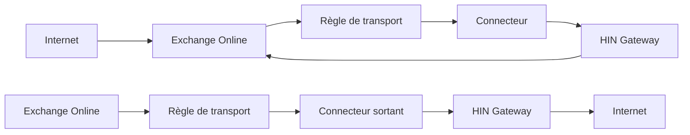

# Intégration Exchange avec HIN Gateway

Ce guide explique comment configurer Microsoft Exchange (Online et On-Premises) pour acheminer les courriels via la passerelle HIN Gateway pour la signature et le chiffrement S/MIME.

<!-- Référence interne
     Ce guide est basé sur la page wiki [HIN Gateway mail relay setup](https://plan.vereign.com/projects/mail-gateway/wiki/stargate-mail-relay-setup) (par Zdravko Komitov). -->

{ width=32%; }
{ width=32%; }
{ width=32%; }

## Aperçu

HIN Gateway agit comme un relais de courrier entre les serveurs de courrier externes et votre environnement Exchange. Deux modèles d'intégration sont pris en charge:

**Modèle A - Exchange Online comme MX principal avec règles de transport :**



**Modèle B - HIN Gateway comme MX principal:**

```mermaid
flowchart LR
    I1 --> mx15 --> mx20
    EO --> TR --> OC --> HIN Gateway --> I2
    I1["Internet"]
    I2["Internet"]
    mx15["HIN Gateway (priorité MX 15)"]
    mx20["Exchange Online (priorité MX 20)"]
    EO["Exchange Online"]
    TR["Règle de transport"]
    OC["Connecteur sortant"]
    HIN Gateway
```

Dans les deux modèles, vous avez besoin de:

1. **Enregistrements DNS** pointant vers le serveur HIN Gateway
2. **Connecteur sortant** - achemine les courriels d'Exchange vers HIN Gateway
3. **Connecteur entrant** - accepte les courriels de HIN Gateway dans Exchange
4. **Règle de transport** - déclenche le connecteur sortant pour les destinataires externes

## Prérequis

Avant de configurer Exchange, assurez-vous que:

- [X] HIN Gateway est installé et en cours d'exécution ([instructions de déploiement](Docker-deploy.md))
- [X] Vous disposez de **l'adresse IP publique du serveur HIN Gateway** (référencée ci-dessous comme `<HIN_GATEWAY_IP>`)
- [X] Vous disposez du **nom d'hôte de courrier** du serveur HIN Gateway (référencé ci-dessous comme `<MAIL_HOSTNAME>`, ex. `mail.example.com`)
- [X] Vous connaissez votre **domaine de courrier** (référencé ci-dessous comme `<YOUR_DOMAIN>`, ex. `example.com`)
- [X] Vous avez un accès **admin Exchange** (Centre d'administration Exchange ou Shell de gestion Exchange sur site)
- [X] Les enregistrements DNS sont configurés selon le [Guide de configuration DNS](DNS-setup.md) (A, MX, SPF au minimum)

---

## Partie 1: Configuration DNS

Consultez le [Guide de configuration DNS](DNS-setup.md) pour des instructions complètes sur la configuration des enregistrements A, MX, SPF, PTR, DMARC et DKIM.

Au minimum, avant de procéder à la configuration Exchange ci-dessous, vous avez besoin de:

- **Enregistrement A**: `<MAIL_HOSTNAME>` pointant vers `<HIN_GATEWAY_IP>`
- **Enregistrement MX**: `<YOUR_DOMAIN>` avec HIN Gateway à une priorité plus élevée (nombre inférieur) qu'Exchange
- **Enregistrement SPF**: `ip4:<HIN_GATEWAY_IP>` et `ip4:<HIN_SEALER_IP>` ajoutés à l'enregistrement TXT de votre domaine (voir [Guide de configuration DNS - SPF](DNS-setup.md#enregistrement-spf) pour les IPs du scelleur)

---

## Partie 2: Configuration Exchange Online

### Étape A: Créer le connecteur sortant (Office 365 → HIN Gateway)

Ce connecteur achemine les courriels sortants d'Exchange Online vers le serveur relais HIN Gateway.

1. Accédez au [Centre d'administration Exchange - Connecteurs](https://admin.exchange.microsoft.com/#/connectors)

2. Cliquez sur **"+ Ajouter un connecteur"**

3. **Connexion depuis**: Sélectionnez **"Office 365"**
   - **Connexion vers**: Sélectionnez **"Serveur de courrier de votre organisation"**
   - Cliquez sur **"Suivant"**

4. **Nom du connecteur**: Entrez un nom descriptif, ex.:

   ```plain
   From Office 365 to HIN Gateway relay server
   ```

   - Cochez **"Conserver les en-têtes de courrier internes Exchange"**
   - Cliquez sur **"Suivant"**

5. **Utilisation du connecteur**: Sélectionnez **"Uniquement lorsque j'ai une règle de transport configurée qui redirige les messages vers ce connecteur"**
   - Cliquez sur **"Suivant"**

!!! tip
    Ceci est important - le connecteur n'acheminera aucun courrier par lui-même. Il ne sera utilisé que lorsqu'il sera déclenché par la règle de transport créée à l'étape C.

1. **Routage**: Sélectionnez **"Acheminer les courriels via ces hôtes intelligents"**
   - Entrez l'adresse IP du serveur HIN Gateway: `<HIN_GATEWAY_IP>`
   - Cliquez sur **"+"** pour l'ajouter, puis sur **"Suivant"**

2. **Restrictions de sécurité**: Sélectionnez **"Tout certificat numérique, y compris les certificats auto-signés"**
   - Cliquez sur **"Suivant"**

!!! note
    Le MTA de HIN Gateway (Stalwart) accepte TLS opportuniste sur les connexions entrantes. Sélectionner "tout certificat numérique" assure la connectivité même avec des certificats auto-signés.

1. **Courriel de validation**: Entrez une adresse de courrier valide pour votre domaine (ex. `user@<YOUR_DOMAIN>`)
   - Cliquez sur **"+"**, puis sur **"Valider"**
   - Attendez que la validation se termine, puis cliquez sur **"Suivant"**

!!! tip
    Pour que la validation réussisse, le serveur HIN Gateway doit être en cours d'exécution et accepter les courriels sur le port 25.

1. Examinez les paramètres et cliquez sur **"Créer un connecteur"**

2. Sur l'écran de confirmation, cliquez sur **"Terminé"**

### Étape B: Créer le connecteur entrant (HIN Gateway → Office 365)

Ce connecteur accepte les courriels du serveur relais HIN Gateway dans Exchange Online.

1. Depuis la [page Connecteurs](https://admin.exchange.microsoft.com/#/connectors), cliquez sur **"+ Ajouter un connecteur"**

2. **Connexion depuis**: Sélectionnez **"Serveur de courrier de votre organisation"**
   - **Connexion vers**: Affiche **"Office 365"** (automatique)
   - Cliquez sur **"Suivant"**

3. **Nom du connecteur**: Entrez un nom descriptif, ex.:

   ```plain
   Receive mail from HIN Gateway relay server
   ```

   - Cochez **"Conserver les en-têtes de courrier internes Exchange"**
   - Cliquez sur **"Suivant"**

4. **Authentification des courriels envoyés**: Sélectionnez **"En vérifiant que l'adresse IP du serveur d'envoi correspond à l'une des adresses IP suivantes qui appartiennent exclusivement à votre organisation"**
   - Entrez l'adresse IP du serveur HIN Gateway: `<HIN_GATEWAY_IP>`
   - Cliquez sur **"+"** pour l'ajouter, puis sur **"Suivant"**

!!! note
    Cela indique à Exchange Online de faire confiance aux courriels provenant de cette adresse IP spécifique, en contournant les vérifications supplémentaires de spam/authentification pour les courriels déjà traités par HIN Gateway.

1. Examinez les paramètres et cliquez sur **"Créer un connecteur"**

2. Cliquez sur **"Terminé"**

### Vérifier les connecteurs

Après avoir créé les deux connecteurs, la page Connecteurs devrait afficher:

| Statut | Nom | Depuis | Vers |
| -------- | ------ | ------ | ----- |
| Activé | Receive mail from HIN Gateway relay server | Votre org | O365 |
| Activé | From Office 365 to HIN Gateway relay server | O365 | Votre org |

### Étape C: Créer la règle de transport

La règle de transport redirige tous les courriels sortants via le connecteur sortant HIN Gateway, sauf les courriels provenant de HIN Gateway lui-même (pour éviter les boucles de courrier).

1. Accédez au [Centre d'administration Exchange - Règles](https://admin.exchange.microsoft.com/#/transportrules)

2. Cliquez sur **"+ Ajouter une règle"** → **"Créer une nouvelle règle"**

3. **Nom de la règle**: Entrez un nom descriptif, ex.:

   ```plain
   Relay all mail to HIN Gateway except mail coming from it
   ```

4. **Appliquer cette règle si**: Sélectionnez **"Le destinataire..."** → **"est externe/interne"** → **"En dehors de l'organisation"**
   - Cliquez sur **"Enregistrer"**

!!! note
    Cette condition garantit que seuls les courriels sortants (vers des destinataires externes) sont redirigés via HIN Gateway.

1. **Faire ce qui suit**: Sélectionnez **"Rediriger le message vers..."** → **"le connecteur suivant"** → sélectionnez le connecteur sortant créé à l'étape A (ex. "From Office 365 to HIN Gateway relay server")
   - Cliquez sur **"Enregistrer"**

2. **Sauf si**: Cliquez sur **"+"** pour ajouter une exception
   - Sélectionnez **"L'expéditeur..."** → **"L'adresse IP se trouve dans l'une de ces plages"**
   - Entrez l'adresse IP du serveur HIN Gateway: `<HIN_GATEWAY_IP>`
   - Cliquez sur **"Ajouter"**, vérifiez que l'IP est listée, puis cliquez sur **"Enregistrer"**

!!! warning
    **Cette exception est critique** - elle empêche les boucles de courrier. Sans elle, les courriels de HIN Gateway arrivant dans Exchange Online seraient redirigés vers HIN Gateway dans une boucle infinie.

1. Examinez le résumé de la règle. Il devrait afficher:
   - **Appliquer cette règle si**: Le destinataire est situé En dehors de l'organisation
   - **Faire ce qui suit**: Rediriger le message vers le connecteur "From Office 365 to HIN Gateway relay server"
   - **Sauf si**: L'adresse IP de l'expéditeur se trouve dans l'une de ces plages: `<HIN_GATEWAY_IP>`

2. Cliquez sur **"Suivant"**, puis sur **"Suivant"** à nouveau, puis sur **"Terminer"**, puis sur **"Terminé"**

3. **Activer la règle**: La règle est créée dans un état désactivé. Cliquez sur la règle dans la liste et basculez **"Activer ou désactiver la règle"** sur **"Activé"**

!!! tip
    N'oubliez pas d'activer la règle - elle ne fonctionnera pas tant qu'elle ne sera pas activée.

---

## Partie 3: Configuration du serveur Exchange On-Premises

Pour Exchange Server On-Premises (2016, 2019), la configuration est similaire mais effectuée via la console de gestion Exchange (EAC) ou le Shell de gestion Exchange (PowerShell).

### Connecteur d'envoi (On-Premises → HIN Gateway)

Créez un connecteur d'envoi pour acheminer les courriels sortants via HIN Gateway:

**Shell de gestion Exchange (PowerShell) :**

```powershell
New-SendConnector -Name "To HIN Gateway Relay" `
  -AddressSpaces "SMTP:*;1" `
  -SmartHosts "<HIN_GATEWAY_IP>" `
  -SmartHostAuthMechanism None `
  -DNSRoutingEnabled $false `
  -SourceTransportServers "<VOTRE_SERVEUR_EXCHANGE>"
```

**Centre d'administration Exchange (GUI) :**

1. Accédez à **Flux de courrier** → **Connecteurs d'envoi**
2. Cliquez sur **+** pour créer un nouveau connecteur
3. **Nom**: "To HIN Gateway Relay"
4. **Type**: Sélectionnez **"Internet"**
5. **Paramètres réseau**: Sélectionnez **"Acheminer les courriels via des hôtes intelligents"**, ajoutez `<HIN_GATEWAY_IP>`
6. **Authentification de l'hôte intelligent**: Sélectionnez **"Aucune"**
7. **Espace d'adressage**: Ajoutez `*` (tous les domaines) ou des domaines externes spécifiques
8. **Serveur source**: Sélectionnez votre ou vos serveurs de transport Exchange

### Connecteur de réception (HIN Gateway → On-Premises)

Créez ou modifiez un connecteur de réception pour accepter les courriels de HIN Gateway:

**Shell de gestion Exchange (PowerShell) :**

```powershell
New-ReceiveConnector -Name "From HIN Gateway Relay" `
  -Bindings "0.0.0.0:25" `
  -RemoteIPRanges "<HIN_GATEWAY_IP>" `
  -TransportRole FrontendTransport `
  -Usage Custom `
  -AuthMechanism ExternalAuthoritative `
  -PermissionGroups ExchangeServers
```

**Centre d'administration Exchange (GUI) :**

1. Accédez à **Flux de courrier** → **Connecteurs de réception**
2. Cliquez sur **+** pour créer un nouveau connecteur
3. **Nom**: "From HIN Gateway Relay"
4. **Type**: Sélectionnez **"Transport frontal"**
5. **Liaisons des adaptateurs réseau**: Laissez par défaut ou liez à une IP spécifique
6. **Paramètres réseau distants**: Supprimez la valeur par défaut `0.0.0.0-255.255.255.255` et ajoutez uniquement `<HIN_GATEWAY_IP>`
7. **Authentification**: Cochez **"Sécurisé externellement"**
8. **Groupes de permissions**: Cochez **"Serveurs Exchange"**

### Règle de transport (On-Premises)

Créez une règle de transport pour rediriger les courriels sortants via le connecteur d'envoi:

**Shell de gestion Exchange (PowerShell) :**

```powershell
New-TransportRule -Name "Relay outbound via HIN Gateway" `
  -SentToScope NotInOrganization `
  -RouteMessageOutboundConnector "To HIN Gateway Relay" `
  -ExceptIfSenderIpRanges "<HIN_GATEWAY_IP>"
```

**Centre d'administration Exchange (GUI) :**

1. Accédez à **Flux de courrier** → **Règles**
2. Cliquez sur **+** → **"Créer une nouvelle règle"**
3. **Nom**: "Relay outbound via HIN Gateway"
4. **Appliquer cette règle si**: "Le destinataire est situé..." → "En dehors de l'organisation"
5. **Faire ce qui suit**: "Rediriger le message vers..." → "le connecteur suivant" → "To HIN Gateway Relay"
6. **Sauf si**: "L'adresse IP de l'expéditeur est dans..." → ajoutez `<HIN_GATEWAY_IP>`

---

## Partie 4: Configuration côté HIN Gateway

### Configuration automatique (Par défaut)

Par défaut, Stalwart découvre automatiquement où livrer les courriels traités en consultant les enregistrements MX pour chaque domaine configuré via la page `/mail` du tableau de bord. Il filtre son propre nom d'hôte et utilise les entrées MX restantes comme cibles de livraison.

Cela fonctionne lorsque:

- Votre domaine a des enregistrements MX pointant à la fois vers HIN Gateway et Exchange
- HIN Gateway a un enregistrement MX de priorité plus élevée (nombre inférieur) qu'Exchange

### Remplacement manuel via le tableau de bord

Si vous souhaitez que tous les courriels sortants de HIN Gateway aillent vers un seul point de terminaison Exchange (ex. Exchange Online Protection), définissez l'hôte de relais via la page `/mail` du tableau de bord (ex. `[smtp.office365.com]`). Le tableau de bord envoie la valeur à l'API REST de mtaconf et le démon l'applique à Stalwart.

!!! note
    Un seul hôte de relais envoie tous les courriels via un seul serveur et ne prend pas en charge le routage par domaine. Pour plusieurs domaines acheminés via différents serveurs Exchange, utilisez la carte de relais par domaine sur la même page du tableau de bord (configure `sender_dependent_relayhost_maps` en arrière-plan) - voir [Configuration multi-domaines](#configuration-multi-domaines) ci-dessous.

### Configuration multi-domaines

Pour les configurations avec plusieurs domaines et différents serveurs Exchange (ex. BALZ Informatik AG avec 26 domaines), utilisez les enregistrements MX pour le routage par domaine:

```plain
domain1.com    MX 10  exchange1.domain1.com
domain1.com    MX 20  stargate.domain1.com

domain2.com    MX 10  exchange2.domain2.com
domain2.com    MX 20  stargate.domain2.com
```

Les enregistrements MX de chaque domaine indiquent à HIN Gateway où livrer les courriels traités pour ce domaine spécifique.

### Vérifier la configuration HIN Gateway

Après la configuration, vérifiez la configuration de Stalwart:

#### Vérifier la configuration du relais

```bash
docker logs stargate-stalwart --tail 50 | grep -i relay
```

#### Vérifier la file d'attente des courriels (devrait être vide quand tout fonctionne)

```bash
docker exec stargate-stalwart stalwart-cli -u http://localhost:8080 queue list
```

#### Envoyer un courriel de test et vérifier les logs

```bash
docker logs stargate-stalwart --tail 50
```

## Dépannage

### Les courriels ne quittent pas Exchange Online

- Vérifiez que la règle de transport est **activée** (elle est créée dans un état désactivé)
- Vérifiez les conditions de la règle - elle devrait s'appliquer aux destinataires "En dehors de l'organisation"
- Vérifiez que la validation du connecteur sortant a réussi
- Vérifiez la trace des messages Exchange dans le Centre d'administration pour l'état de livraison

### Boucles de courrier (messages dupliqués)

- Assurez-vous que la règle de transport a **l'exception** pour l'adresse IP de HIN Gateway
- Sans cette exception, les courriels de HIN Gateway arrivant dans Exchange sont redirigés vers HIN Gateway

### HIN Gateway n'accepte pas les courriels d'Exchange

- Vérifiez que le port 25 est ouvert sur le pare-feu du serveur HIN Gateway
- Vérifiez que l'enregistrement SPF inclut l'IP HIN Gateway
- Vérifiez les logs Stalwart: `docker logs stargate-stalwart`

### Exchange Online rejette les courriels de HIN Gateway

- Vérifiez que le connecteur entrant est configuré avec la bonne IP HIN Gateway
- Vérifiez que l'IP HIN Gateway n'a pas changé
- Vérifiez que le connecteur est activé (Statut: Activé)

### Erreurs de certificat TLS

HIN Gateway utilise TLS opportuniste avec un certificat auto-signé. Le connecteur sortant dans Exchange doit être configuré pour accepter "Tout certificat numérique, y compris les certificats auto-signés". Si vous voyez des erreurs liées à TLS:

- Vérifiez que le paramètre de sécurité du connecteur sortant autorise les certificats auto-signés
- Pour Exchange On-Premises, assurez-vous que le connecteur d'envoi ne nécessite pas TLS (`-RequireTLS $false`)

### La validation échoue lors de la création du connecteur

La validation du connecteur sortant nécessite:

- Le serveur HIN Gateway est en cours d'exécution et accepte les connexions sur le port 25
- L'adresse de courrier de validation est valide pour votre domaine
- Le chemin réseau entre Exchange Online et HIN Gateway est ouvert (pas de blocage par pare-feu)

---

## Référence rapide

| Composant | Emplacement Exchange Online | Objectif |
| ----------- | -------------------------- | --------- |
| Connecteur sortant | Centre d'administration → Flux de courrier → Connecteurs | Acheminer les courriels sortants vers HIN Gateway |
| Connecteur entrant | Centre d'administration → Flux de courrier → Connecteurs | Accepter les courriels de HIN Gateway |
| Règle de transport | Centre d'administration → Flux de courrier → Règles | Déclencher le connecteur sortant pour les destinataires externes |

| Enregistrement DNS | Exemple | Objectif |
| ------------ | --------- | --------- |
| A | `mail IN A <HIN_GATEWAY_IP>` | Pointer le nom d'hôte vers HIN Gateway |
| MX (HIN Gateway) | `@ IN MX 15 mail.<YOUR_DOMAIN>.` | Les courriels entrants frappent d'abord HIN Gateway |
| MX (Exchange) | `@ IN MX 20 <DOMAIN>.mail.protection.outlook.com.` | Secours / cible de livraison |
| SPF | `ip4:<HIN_GATEWAY_IP>` et `ip4:<HIN_SEALER_IP>` ajoutés à l'enregistrement TXT existant | Autoriser HIN Gateway et le scelleur HIN à envoyer des courriels |

Pour la configuration DNS complète (y compris PTR, DMARC, DKIM et multi-domaines), consultez le [Guide de configuration DNS](DNS-setup.md).
