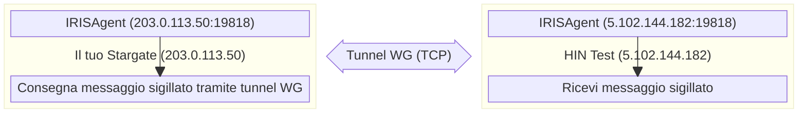
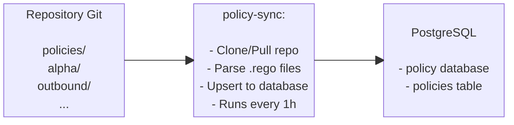

# Configurazione avanzata di Stargate Docker

## Backup

### Backup automatici

* I backup giornalieri vengono eseguiti alle 2:00 AM tramite cron (impostati durante l'installazione)
* I backup vengono archiviati in `./backups/` come file `.tar.gz` con timestamp
* I vecchi backup (>7 giorni) vengono automaticamente eliminati

### Cosa è incluso nei backup

* **Dump PostgreSQL completo** (tutti i database con utenti e permessi)
* **Dump di database individuali** (per ripristino parziale se necessario)
* **Chiavi Vault** (`vault-keys.json` per lo scongelamento)
* **Configurazione cliente** (`customer-config.sh` con chiave WireGuard)
* **CSR e certificati S/MIME** (tutti i file `.crt`, `.pem`, `.cer`)
* **Manifesto del backup** (`manifest.json` con metadati)

### Backup manuale

```bash
./scripts/backup.sh
```

Crea un archivio compresso in `./backups/YYYYMMDD_HHMMSS.tar.gz`.

### Ripristino dal backup

Per ripristinare su una **nuova macchina** o dopo una **pulizia**. Copiare l'archivio di backup sulla nuova macchina ed eseguire:

```bash
./scripts/restore.sh backups/20260130_143022.tar.gz
```

Lo script di ripristino:

1. Arresta tutti i servizi in esecuzione
2. Estrae e valida il backup
3. Installa Docker se necessario
4. Ripristina la configurazione cliente
5. Avvia i servizi di infrastruttura (PostgreSQL, Vault, MinIO)
6. Ripristina il database
7. Scongela Vault con le chiavi di backup
8. Avvia i servizi applicativi

### Ripristino parziale (database singolo)

Se è necessario ripristinare solo un database:

#### Estrarre il backup

```bash
tar -xzf backups/20260130_143022.tar.gz -C /tmp/
```

#### Ripristinare un database specifico

```bash
cat /tmp/20260130_143022/database/mxengine.sql | docker exec -i stargate-postgres psql -U postgres -d mxengine
```

## Aggiornamento di Stargate

### Aggiornare script di deployment e configurazione

Il repository di deployment di Stargate riceve aggiornamenti per script (`install.sh`, `start.sh`, `health-check.sh`, `restore.sh`, ecc.), modelli di configurazione e documentazione. Per applicare questi aggiornamenti:

#### 1. Creare un backup prima dell'aggiornamento

```bash
./scripts/backup.sh
```

#### 2. Eseguire il pull delle ultime modifiche dal repository

```bash
git pull
```

#### 3. Riavviare i servizi per applicare eventuali modifiche a script o configurazione

```bash
./scripts/stop.sh
./scripts/start.sh
```

!!! note
    `git pull` non sovrascriverà `customer-config.sh`, `.env` o la directory `secrets/` - questi sono in `.gitignore`. Se si hanno modifiche locali a file tracciati (es. `docker-compose.yml`), git avviserà. In tal caso, mettere da parte le modifiche prima con `git stash`, fare pull, quindi riapplicare con `git stash pop`.

Se l'aggiornamento include modifiche al modello di configurazione, confrontarlo con la configurazione esistente per vedere se sono state aggiunte nuove variabili:

```bash
diff customer-config.sh customer-config-prod.example.sh
```

### Aggiornare le immagini dei servizi

#### Aggiornare un singolo servizio

Modificare la versione in `.env`:

```bash
sed -i 's/MXENGINE_VERSION=.*/MXENGINE_VERSION=v0.0.31/' .env
```

Quindi eseguire il pull del container e ricrearlo:

```bash
docker compose pull mxengine
docker compose up -d --force-recreate mxengine
```

#### Test rapido (senza modificare .env)

Sovrascrivere la versione direttamente:

```bash
MXENGINE_VERSION=v0.0.31 docker compose up -d --force-recreate mxengine
```

#### Aggiornare più servizi

Modificare le versioni in `.env`, quindi eseguire il pull dei container e ricrearli:

```bash
docker compose pull smimekeys-client policy irisagent mxengine
docker compose up -d --force-recreate smimekeys-client policy irisagent mxengine
```

#### Aggiornare tutti i servizi

Eseguire il pull di tutte le ultime immagini

```bash
docker compose pull
```

Ricreare tutti i servizi

```bash
docker compose up -d --force-recreate
```

#### Pulire le vecchie immagini

Dopo gli aggiornamenti, rimuovere le immagini inutilizzate per liberare spazio su disco:

```bash
docker image prune -f
```

#### Rollback

Per eseguire un rollback, modificare `.env` alla versione precedente e ricreare:

```bash
sed -i 's/MXENGINE_VERSION=.*/MXENGINE_VERSION=v0.0.30/' .env
docker compose up -d --force-recreate mxengine
```

## Configurazione

Il file `.env` viene generato da `install.sh` da `customer-config.sh`. Le impostazioni di dominio, certificato e WireGuard sono gestite in fase di esecuzione dal dashboard (`/installation`, `/onboarding`, `/mail`) — non sono conservate in `.env`. Per personalizzare le impostazioni di installazione, modificare `customer-config.sh` e rieseguire `install.sh`.

Sezioni chiave nel `.env` generato:

```bash
## PostgreSQL (auto-generato se vuoto in customer-config.sh)
POSTGRES_USER=postgres
POSTGRES_PASSWORD=<auto-generato>

## Vault (auto-populato dopo l'inizializzazione)
VAULT_TOKEN=<auto-generato>

## Storage di oggetti S3 (SeaweedFS)
S3_ACCESS_KEY=minioadmin
S3_SECRET_KEY=<auto-generato>

## Versioni delle applicazioni
SMIMEKEYS_VERSION=v0.0.5
POLICY_VERSION=v0.0.5
IRISAGENT_VERSION=v0.0.6-branch
MXENGINE_VERSION=v0.0.35
MTACONF_VERSION=dev

## Percorso posta in uscita
MXENGINE_PUBLIC_ADDRESS=http://203.0.113.50:8084
OUTBOUND_SEALER_MX_DOMAIN=hintest.ch

## WireGuard
WG_LOCAL_IP=203.0.113.50
WG_INTERFACE_PORT=19818
WG_TRANSPORT_MODE=tcp
```

!!! warning
    **Non modificare `.env` direttamente.** Le modifiche verranno sovrascritte alla successiva esecuzione di `install.sh`. Per la configurazione in fase di esecuzione (domini, nome host, peer, S/MIME), utilizzare il dashboard.

## URL dei servizi

| Servizio | URL/Porta |
|---------|----------|
| Dashboard | <https://localhost> |
| smimekeys-client | <http://localhost:8081> |
| policy | <http://localhost:8082> |
| irisagent | <http://localhost:8083> |
| mxengine HTTP | <http://localhost:8084> |
| Stalwart SMTP | localhost:25 |
| Gateway APISIX | <http://localhost:9080> |
| Keycloak | <https://localhost:8180> |
| PostgreSQL | localhost:5432 |

## Health Check

Tutti i servizi espongono un endpoint `/liveness`:

```bash
curl http://localhost:8081/liveness  # smimekeys-client
curl http://localhost:8082/liveness  # policy
curl http://localhost:8083/liveness  # irisagent
curl http://localhost:8084/liveness  # mxengine
```

## Monitoraggio

### Metriche Prometheus

Tutti i servizi applicativi espongono metriche Prometheus sulla porta 2112 (internamente), mappate a diverse porte host:

| Servizio | Porta metriche | URL metriche |
|---------|--------------|-------------|
| smimekeys-client | `2113` | <http://localhost:2113/metrics> |
| irisagent | `2114` | <http://localhost:2114/metrics> |
| policy | `2115` | <http://localhost:2115/metrics> |
| mxengine | `2116` | <http://localhost:2116/metrics> |
| node-exporter | `9100` | <http://localhost:9100/metrics> |

### Esempio di configurazione scrape Prometheus

```yaml
scrape_configs:
  - job_name: 'stargate-smimekeys'
    static_configs:
      - targets: ['<host>:2113']
  - job_name: 'stargate-irisagent'
    static_configs:
      - targets: ['<host>:2114']
  - job_name: 'stargate-policy'
    static_configs:
      - targets: ['<host>:2115']
  - job_name: 'stargate-mxengine'
    static_configs:
      - targets: ['<host>:2116']
  - job_name: 'stargate-node'
    static_configs:
      - targets: ['<host>:9100']
```

### Controllo rapido delle metriche

```bash
## Controllare tutti gli endpoint delle metriche
curl -s http://localhost:2113/metrics | head -20  # smimekeys-client
curl -s http://localhost:2114/metrics | head -20  # irisagent
curl -s http://localhost:2115/metrics | head -20  # policy
curl -s http://localhost:2116/metrics | head -20  # mxengine
curl -s http://localhost:9100/metrics | head -20  # node-exporter
```

### Raccolta log (Alloy → Loki)

Alloy raccoglie i log dai container delle applicazioni e li invia a Loki.

**Container monitorati:**

* stargate-apisix
* stargate-keycloak
* stargate-dashboard
* stargate-smimekeys-client
* stargate-policy
* stargate-policy-sync
* stargate-irisagent
* stargate-mxengine

**Configurazione** in `.env`:

```env
## URL di push Loki
LOKI_URL=https://loki.example.com

## Etichetta nome host per i log (auto-impostata su DEPLOYMENT_NAME)
ALLOY_HOSTNAME=stargate-acme
```

**Etichette aggiunte ai log:**

* `environment=<DEPLOYMENT_NAME>` - Identifica il deployment
* `host=<ALLOY_HOSTNAME>` - Identifica l'host (come il nome del deployment)
* `container=<nome-container>` - Nome del container
* `service=<nome-servizio>` - Nome del servizio (es., smimekeys-client, policy)
* `level=<livello-log>` - Estratto dai log JSON se disponibile

**Interrogare i log in Grafana:**

```logql
{environment="stargate-acme"} |= "error"
{environment="stargate-acme", service="mxengine"}
{environment="stargate-acme", level="error"}
```

**Verificare che Alloy funzioni:**

=== "Controllare lo stato di Alloy e l'attività recente"

    ```bash
    docker logs stargate-alloy
    ```

=== "Sonda di salute (dall'interno del network Docker)"

    ```bash
    docker exec stargate-alloy wget -qO- http://localhost:12345/-/ready
    ```

**Nota:** L'IP pubblico della VM deve essere nella whitelist della configurazione di ingress di Loki.

## Stalwart MTA + mtaconf

Stargate utilizza **Stalwart** come mail transfer agent e **mtaconf** come demone di configurazione. Il dashboard invia la configurazione di domini e relay all'API REST di mtaconf, che la invia a Stalwart tramite la CLI di gestione.

### Architettura del flusso di posta

```plain
Server di posta esterno
         │
         ▼ (porta 25)
┌─────────────────────────────────────────────────────┐
│ stalwart (stargate-stalwart)                        │
│                                                     │
│  Porta 25 (listener smtp)                           │
│    │                                                │
│    ▼                                                │
│  content_filter → smtp:[mxengine]:1587              │
│    │                                                │
└────┼────────────────────────────────────────────────┘
     │
     ▼ (porta 1587)
┌─────────────────────────────────────────────────────┐
│ MXEngine (stargate-mxengine)                        │
│                                                     │
│  Porta 1587 (ingresso SMTP)                         │
│    │                                                │
│    ▼                                                │
│  Firmare/crittografare/elaborare la posta           │
│    │                                                │
│    ▼                                                │
│  Consegnare a stalwart per il relay                 │
│    │                                                │
└────┼────────────────────────────────────────────────┘
     │
     ▼ (porta 10026)
┌─────────────────────────────────────────────────────┐
│ stalwart (stargate-stalwart)                        │
│                                                     │
│  Porta 10026 (listener di reiniezione)              │
│    │                                                │
│    ▼                                                │
│  transport → relay al MX di destinazione            │
│    │                                                │
└────┼────────────────────────────────────────────────┘
     │
     ▼ (porta 25)
Server di posta di destinazione (tramite ricerca MX)
```

**Scansione antivirus:** La posta in entrata viene scansionata da **ClamAV** (`stargate-clamav`), collegato a Stalwart come milter nella fase SMTP DATA sia sul listener pubblico (`:25`) che su quello di reiniezione (`:10026`). La posta infetta viene respinta a livello SMTP; se ClamAV non è raggiungibile, il messaggio viene rinviato piuttosto che consegnato non scansionato (fail-closed). Il database delle firme di ClamAV risiede nel volume `clamav_data` e viene mantenuto aggiornato da freshclam in background.

**Flusso di callback di sigillatura (in entrata):** Quando un sigillatore remoto deve consegnare un messaggio sigillato, chiama `MXENGINE_PUBLIC_ADDRESS` (predefinito: `http://<SERVER_STATIC_IP>:8084`). Questo è il motivo per cui la porta 8084 deve essere aperta per il traffico in entrata. Il protocollo `http://` è corretto - TLS non è richiesto perché il payload del sigillo è già crittografato.

### Configurazione del relay di posta

Tutta la configurazione di posta che varia per deployment (domini di posta, nome host, host di relay, mappe di relay per dominio, reti consentite) viene impostata tramite la **pagina `/mail` del dashboard** in fase di esecuzione. Il dashboard invia la configurazione tramite POST all'API REST di mtaconf, che la applica a Stalwart senza riavviare il container.

Non c'è configurazione per dominio in `customer-config.sh` o `.env` - gli operatori aggiungono o modificano i domini tramite l'interfaccia utente.

### Routing della posta (Migrazione dal vecchio MGW)

!!! tip "Differenza chiave rispetto al vecchio HIN-MGW"
    Nel vecchio MGW, era necessario configurare manualmente un server di destinazione per dominio. In Stargate, il routing della posta è deciso da **record MX DNS per impostazione predefinita** - Stalwart risolve il MX di ogni dominio al momento della consegna. La pagina `/mail` del dashboard consente di sovrascrivere questo comportamento per dominio (es. per relayare attraverso il tenant M365 / Exchange) senza toccare il DNS.

**Predefinito - automatico tramite DNS MX:**

Per ciascuno dei propri domini, assicurarsi che ci sia un record MX nel DNS che punti al corrispondente server Exchange (o altro server di posta):

```plain
domain1.com    MX 10  exchange1.domain1.com
domain2.com    MX 10  exchange2.domain2.com
domain3.com    MX 10  exchange3.domain3.com
```

Funziona per qualsiasi numero di domini - ogni dominio può puntare a un server di posta diverso e Stalwart instraderà di conseguenza.

**Se Stargate è l'unico record MX** per un dominio, Stalwart lo filtrerà e non avrà alcuna destinazione di consegna. Aggiungere un secondo record MX che punti al server di posta con una priorità più alta (= numero inferiore) in modo che Stalwart lo utilizzi come destinazione di consegna:

```plain
example.com    MX 10  exchange.example.com      ← destinazione di consegna (server di posta)
example.com    MX 20  stargate.example.com      ← gateway in entrata (Stargate)
```

**Alternativa - relay esplicito per dominio (basato sul mittente):**

Per il relay di ritorno attraverso M365 / Exchange Online, configurare le destinazioni di relay per dominio tramite la pagina `/mail` del dashboard. La posta dai mittenti non nella mappa ricade sulla ricerca MX.

### Porte

| Porta | Scopo |
|------|---------|
| `25` | Listener SMTP principale (connessioni esterne) |
| `10026` | Porta di reiniezione (mxengine → stalwart, solo interno) |
| `1587` | Ingresso SMTP MXEngine (stalwart → mxengine, solo interno) |
| `8080` | API di gestione Stalwart + API REST mtaconf (solo interno) |

!!! question "Si utilizza Exchange?"
    Vedere [Exchange-integration](Exchange-integration.md) per la configurazione completa dei connettori e delle regole di trasporto Exchange Online / On-Premises.

### Verifica

Controllare lo stato di Stalwart
```bash
docker exec stargate-stalwart stalwart-cli -u http://localhost:8080 server list-listeners
```

Controllare i log
```bash
docker logs stargate-stalwart
```

Testare la connessione alla porta 25
```bash
telnet localhost 25
```

Testare la porta interna 10026 (dal container mxengine)
```bash
docker exec stargate-mxengine nc -zv stalwart 10026
```

### Aggiornamento dell'immagine mtaconf

Il container mtaconf viene scaricato dal registry. Per aggiornare a un nuovo tag:

```bash
sed -i 's/MTACONF_VERSION=.*/MTACONF_VERSION=<nuovo-tag>/' .env
docker compose pull mtaconf
docker compose up -d mtaconf
```

### Risoluzione dei problemi di Stargate

**Posta non elaborata da mxengine**:

* Verificare che content_filter sia configurato: controllare che i log mtaconf mostrino il push riuscito
* Verificare che mxengine sia raggiungibile: `docker exec stargate-stalwart nc -zv mxengine 1587`

**Posta bloccata dopo l'elaborazione di mxengine**:

* Verificare la configurazione in uscita di mxengine: OUTBOUND_SMTP_HOST=stalwart, OUTBOUND_SMTP_PORT=10026
* Verificare che il listener sulla porta 10026 sia attivo in Stalwart
* Verificare che le reti di relay consentite includano la rete Docker (172.x.x.x/16)

**Errori di greylisting (450 4.7.1)**:

* È normale! Il server di destinazione sta rifiutando temporaneamente la posta
* Stalwart riprova automaticamente dopo un ritardo configurabile
* Controllare la coda tramite l'API di gestione

**Microsoft blocca l'IP (S3140)**:

* L'IP del server ha una cattiva reputazione presso Microsoft
* Richiedere la rimozione dalla lista su: <https://sender.office.com>
* Potrebbero essere necessarie 24-48 ore per avere effetto

**Fallimenti di ricerca DNS**:

* Utilizzare la pagina `/mail` del dashboard per impostare un host di relay esplicito o una mappa di relay per dominio (salta la scoperta basata su MX)

**Connessione rifiutata sulla porta 25**:

* Assicurarsi che la porta 25 non sia bloccata dal firewall
* Verificare se un altro servizio sta utilizzando la porta 25: `ss -tlnp | grep :25`

## WireGuard (Comunicazione Agente-Agente)

IRISAgent utilizza WireGuard per stabilire tunnel crittografati sicuri tra istanze Stargate per la consegna di messaggi sigillati.

### Come funziona

Ogni istanza Stargate utilizza l'IP pubblico statico reale del proprio server come indirizzo del tunnel WireGuard. Questo garantisce l'unicità tra tutti i deployment senza coordinazione manuale.



### Configurazione WireGuard

Impostazioni WireGuard in `customer-config.sh`:

```bash
## ==============================================================================
## IP del server — utilizzato come indirizzo del tunnel WireGuard e URL di callback MXEngine
## ==============================================================================
SERVER_STATIC_IP="203.0.113.50"       # L'IP pubblico statico reale del server

## ==============================================================================
## Impostazioni locali WireGuard (in genere lasciate ai valori predefiniti)
## ==============================================================================
WG_PRIVATE_KEY=""                     # Auto-generato da IRISAgent, poi salvato nella configurazione
WG_INTERFACE_PORT="19818"             # Porta WireGuard predefinita
WG_TRANSPORT_MODE="tcp"               # "tcp" (predefinito) o "udp"

```

!!! info
    **`WG_LOCAL_IP`** è auto-derivato da `SERVER_STATIC_IP`. Non è necessario impostarlo separatamente.

### Configurazione della connessione peer

I dettagli del peer WireGuard (chiave pubblica, endpoint, IP consentiti, ecc.) sono configurati in fase di esecuzione tramite la pagina `/installation` del dashboard. Non c'è più un blocco `WG_PEER_*` in `customer-config.sh` — il peer viene configurato dopo che lo stack è attivo.

Per la configurazione iniziale con l'ambiente HIN Test:

1. Avviare lo stack con `./scripts/install.sh`.
2. Aprire il dashboard, seguire `/installation` per avviare l'handshake nonce / HIN.
3. Aprire i log IRISAgent (`docker compose logs irisagent`) e copiare la riga `wireguard public key:`. Inviarla insieme a `DEPLOYMENT_NAME` e `SERVER_STATIC_IP` a Vereign (<kalin.canov@vereign.com>) in modo che possano registrare il peer sul lato CA.
4. Dopo la conferma della registrazione da parte di Vereign, completare `/onboarding` nel dashboard per emettere il certificato S/MIME.

Per qualsiasi **peer aggiuntivo** (peer-to-peer tra due Stargate), scambiare chiavi pubbliche + endpoint con l'altra parte e aggiungere la connessione tramite l'API IRISAgent:

```bash
curl --location 'localhost:8083/v1/connections' \
--header 'Content-Type: application/json' \
--header 'Accept: application/json' \
--data '{
  "allowedIps": "<IP del nuovo peer>/32",
  "description": "<breve descrizione>",
  "endpoint": "<IP del nuovo peer>:19818",
  "externalId": [
    "<dominio del nuovo peer>"
  ],
  "name": "<Nome del nuovo peer>",
  "presharedKey": "",
  "publicKey": "<chiave pubblica del nuovo peer>",
  "status": "completed",
  "transport": "tcp",
  "wireguardIp": "<IP del nuovo peer>",
  "wireguardPort": 10080
}'
```

### Verifica WireGuard

Controllare l'interfaccia WireGuard di IRISAgent

```bash
docker exec stargate-irisagent wg show
```

Controllare la connessione nel database

```bash
docker exec stargate-postgres psql -U postgres -d irisagent \
  -c "SELECT connection_id, name, endpoint, wireguard_ip, transport, status FROM connections;"
```

Controllare gli ID esterni della connessione (utilizzati per il routing)

```bash
docker exec stargate-postgres psql -U postgres -d irisagent \
  -c "SELECT connection_id, external_id FROM connection_external_ids;"
```

Testare la connettività WireGuard (controllare lo stato del tunnel dall'host)

```bash
docker logs stargate-irisagent 2>&1 | grep -i "handshake\|peer.*added\|started listening"
```

Controllare i log IRISAgent per l'attività del tunnel

```bash
docker logs stargate-irisagent | grep -i wireguard
```

### Risoluzione dei problemi WireGuard

**Nessuna interfaccia WireGuard:**

* Controllare i log IRISAgent: `docker logs stargate-irisagent`
* Verificare che `WG_LOCAL_IP` sia impostato in `.env` (auto-derivato da `SERVER_STATIC_IP` — dovrebbe essere l'IP pubblico statico di questo server)

**Peer non raggiungibile:**

* Verificare che l'endpoint remoto sia accessibile: `nc -zv <host_endpoint> <porta_endpoint>`
* Controllare che il firewall consenta la porta TCP+UDP 19818
* Verificare che le chiavi pubbliche corrispondano su entrambe le estremità
* Se TCP ha problemi, provare a impostare `WG_TRANSPORT_MODE="udp"` in customer-config.sh

**Connessione non presente nel database:**

* Rieseguire la pagina `/installation` del dashboard per ristabilire la connessione peer
* Controllare i log irisagent: `docker logs stargate-irisagent`

## Sincronizzazione delle policy

Il servizio `policy-sync` sincronizza automaticamente le policy OPA/Rego da un repository Git al database PostgreSQL.

### Come funziona Policy Sync



### Configurazione di Policy Sync

Impostazioni in `customer-config.sh`:

```bash
## Repository Git contenente le policy (preconfigurato con le policy HIN Stargate)
POLICY_SYNC_REPO_URL="https://github.com/Health-Info-Net-AG/Stargate-policies.git"

## Opzionale: Autenticazione per repo privati
POLICY_SYNC_REPO_USER=""
POLICY_SYNC_REPO_PASS=""

## Opzionale: Branch specifico (predefinito: main)
POLICY_SYNC_REPO_BRANCH=""

## Opzionale: Sottocartella nel repo contenente le policy
POLICY_SYNC_REPO_FOLDER=""

## Intervallo di sincronizzazione (predefinito: 1h)
POLICY_SYNC_INTERVAL="1h"
```

### Verifica di Policy Sync

=== "Controllare lo stato di policy-sync"

    ```bash
    docker logs stargate-policy-sync
    ```

=== "Visualizzare le policy sincronizzate"

    ```bash
    docker exec stargate-postgres psql -U postgres -d policy \
      -c "SELECT name, policy_group, filename, to_timestamp(updated_at) as updated FROM policies ORDER BY name;"
    ```

=== "Visualizzare il contenuto di una policy specifica"

    ```bash
    docker exec stargate-postgres psql -U postgres -d policy \
      -c "SELECT rego FROM policies WHERE name='deliveryStrategy' AND policy_group='alpha';"
    ```

### Attivazione manuale

Per forzare una sincronizzazione immediata:

```bash
docker restart stargate-policy-sync
```

## Vault

### Montaggi Vault

La porta API/UI di Vault (8200) non è pubblicata sull'host; accedere a Vault tramite la CLI all'interno del container (vedere Operazioni manuali Vault di seguito).

I seguenti motori di segreti KV-v2 vengono creati:

* `secret-smimekeys-client`
* `secret-policy`
* `secret-irisagent`
* `secret-mxengine`
* `secret-mtaconf`

### Operazioni manuali Vault

=== "Controllare lo stato"

    ```bash
    docker exec stargate-vault vault status
    ```

=== "Elencare i montaggi"

    ```bash
    docker exec -e VAULT_TOKEN=<token> stargate-vault vault secrets list
    ```

=== "Scrivere un segreto"

    ```bash
    docker exec -e VAULT_TOKEN=<token> stargate-vault vault kv put secret-smimekeys-client/test key=valore
    ```

## Database

Database PostgreSQL creati:

* `smimekeys_client`
* `policy`
* `irisagent`
* `mxengine`

### Connettersi a PostgreSQL

```bash
docker exec -it stargate-postgres psql -U postgres
```

O connettersi esternamente

```bash
psql -h localhost -U postgres -d smimekeys_client
```

## Policy (Rego)

MXEngine utilizza policy OPA/Rego memorizzate in PostgreSQL per determinare la strategia di consegna della posta.

**Raccomandato:** Utilizzare `policy-sync` per sincronizzare automaticamente le policy da un repository Git. Vedere la sezione [Policy Sync](#policy-rego).

### Visualizzare la policy corrente

=== "Elencare tutte le policy"
    ```bash
    docker exec stargate-postgres psql -U postgres -d policy \
      -c "SELECT id, name, policy_group, filename, to_timestamp(updated_at) as updated FROM policies;"
    ```

=== "Visualizzare il contenuto della policy"

    ```bash
    docker exec stargate-postgres psql -U postgres -d policy \
      -c "SELECT rego FROM policies WHERE name='deliveryStrategy';"
    ```

### Posizione delle policy

* **Configurazione MXEngine:** `POLICY_OUTBOUND: "outbound/delivery"`
* **Database:** database `policy`, tabella `policies`
* **Gestito da:** servizio `policy-sync` (sincronizza dal repository Git)

## Log

=== "Tutti i servizi"

    ```bash
    docker compose logs -f
    ```

=== "Servizio specifico"

    ```bash
    docker compose logs -f <servizio>
    ```

    Es.:

    ```bash
    docker compose logs -f smimekeys-client
    docker compose logs -f vault
    ```

## Risoluzione dei problemi

### Emissione certificato fallita / Tunnel WireGuard non stabilito

Questo è il problema più comune dopo l'installazione iniziale. Il certificato S/MIME non può essere emesso perché il tunnel WireGuard verso la CA HIN non è stabilito.

**Sintomi:**

* La pagina `/onboarding` del dashboard segnala un fallimento di invio del CSR
* I log smimekeys-client mostrano: `issue certificate error: certcatunnel: error sending request: irisagent: ... context deadline exceeded`

**Cause profonde (controllare in ordine):**

1. **Peer non registrato sulla CA HIN** - La chiave pubblica WireGuard deve essere registrata sul lato HIN. Fornire a HIN:

   ```bash
   # Ottenere la chiave pubblica WireGuard
   docker compose logs irisagent | grep "public key"
   ```

   Insieme a `DEPLOYMENT_NAME`, `SERVER_STATIC_IP` e `WG_INTERFACE_PORT` (se modificato da 19818).

2. **Firewall che blocca la porta 19818** - Assicurarsi che `19818/TCP` sia aperto sia in entrata che in uscita sul server Stargate.

3. **Nome host errato** - Se il nome host di Stalwart è ancora impostato sul valore predefinito del modello (`mail.example.com`), aggiornarlo tramite la pagina `/mail` del dashboard.

**Dopo la risoluzione del problema:**

Riaprire la pagina `/onboarding` del dashboard per rigenerare il CSR e inviarlo nuovamente attraverso il tunnel ora attivo.

Vedere [Passo 5: Registrazione del peer WireGuard](Docker-deploy.md#passo-5-registrazione-del-peer-wireguard) per il processo completo.

### Vault è congelato dopo il riavvio

Eseguire lo script di avvio che gestisce lo scongelamento:

```bash
./scripts/start.sh
```

### Impossibile scaricare le immagini

Accedere al registry:

```bash
docker login hub.docker.com
```

### Il servizio non si avvia

Controllare i log:

```bash
docker compose logs <nome-servizio>
```

### Reimpostare tutto

!!! warning
    Questi comandi **CANCELLANO TUTTI I DATI** - usare con cautela!

    È possibile ripristinare i dati solo se si eseguono [operazioni di backup](./Docker-advanced.md#backup-manuale) prima e si salva il backup in un luogo sicuro.

```bash
./scripts/purge.sh
./scripts/install.sh
```

## Struttura dei file

```plain
stargate/
├── backups/                      # Backup completi (gitignorato)
│   └── *.tar.gz
├── config
│   ├── apisix
│   │   ├── apisix.yaml.template
│   │   ├── config.yaml
│   │   └── generated
│   │       └── apisix.yaml
│   ├── keycloak
│   │   ├── generated
│   │   └── realm-stargate.json
│   ├── nats
│   │   └── nats.conf
│   ├── nginx
│   │   ├── dashboard.conf
│   │   └── keycloak.conf
│   ├── alloy
│   │   └── config.alloy          # Configurazione invio log Alloy
│   └── vault
│       └── vault.hcl             # Configurazione Vault
├── customer-config-prod.example.sh     # Modello di configurazione (copiare in customer-config.sh)
├── customer-config.sh            # Impostazioni specifiche del cliente (copiate dal modello)
├── docker-compose.yml            # File compose principale
├── .env                          # Variabili d'ambiente (generate da install.sh)
├── init
│   └── postgres
│       └── 01-create-databases.sql
├── scripts
│   ├── backup.sh                 # Backup completo (DB, Vault, config, certificati)
│   ├── gather-app-versions.sh    # Raccoglie le versioni delle app per le metriche node-exporter
│   ├── health-check.sh           # Health check completo di tutti i servizi
│   ├── init-keycloak.sh
│   ├── init-vault.sh             # Inizializzazione Vault (utilizzato dal container vault-init)
│   ├── install.sh                # Prima installazione (Docker, Vault). La configurazione di dominio/certificato/peer avviene successivamente nel dashboard.
│   ├── purge.sh                  # Elimina tutti i dati (distruttivo!)
│   ├── restore.sh                # Ripristina da archivio di backup
│   ├── send-logs-to-support.sh   # Incolla i log online e ottieni un link da fornire al supporto
│   ├── start.sh                  # Avvia i servizi + scongela Vault
│   ├── stop.sh                   # Arresta i container (preserva i dati)
│   └── update.sh
└── secrets/                      # Creato al primo avvio (gitignorato)
    ├── vault-keys.json           # Chiavi di scongelamento Vault (FARE BACKUP!)
    └── signing-key.csr           # Richiesta di firma certificato S/MIME
```

## Controlli rapidi di salute e log

!!! example "Eseguire il health check completo"

    === "Health check rapido"

        ```bash
        ./scripts/health-check.sh
        ```

    === "Output dettagliato"

        ```bash
        ./scripts/health-check.sh -v
        ```

        Con output dettagliato (mostra dettagli WireGuard, risposte liveness).

Questo controlla:

* Tutti gli stati dei container (in esecuzione, healthy)
* Endpoint Liveness (smimekeys-client, policy, irisagent, mxengine)
* Stato di scongelamento di Vault
* Connettività PostgreSQL e tutti i 4 database
* Salute di MinIO
* Stato del tunnel WireGuard e handshake dei peer
* Stalwart MTA (in esecuzione, porta 25, porta 10026)
* Endpoint delle metriche Prometheus
* Utilizzo del disco e della memoria

Per l'ispezione manuale dei log:

Controllare i log (ultime 10 righe)

```bash
docker logs stargate-smimekeys-client --tail 10
docker logs stargate-policy --tail 10
docker logs stargate-irisagent --tail 10
docker logs stargate-mxengine --tail 10
```

Seguire i log in tempo reale

```bash
docker logs -f stargate-mxengine
```

Controllare tutti gli stati dei container

```bash
docker ps -a --format 'table {{.Names}}\t{{.Status}}'
```

Seguire tutti i log dei container in tempo reale

```bash
docker ps -a --format '{{.Names}}' | xargs -I {} sh -c 'docker logs --timestamps -f {} 2>&1 | sed "s/^/[{}] /"'
```

### Fornire log al supporto

È possibile fornire log al nostro supporto tramite [pastebin.hin-infra.ch](https://pastebin.hin-infra.ch) e il comando CLI:

Caricare i log di tutti i container:

=== "Tutti"

    Utilizzare il nostro script:

    ```shell
    ./scripts/send-logs-to-support.sh --all
    ```

    O eseguire manualmente:

    ```shell
    docker ps -a --format '{{.Names}}' | xargs -I {} sh -c 'docker logs --timestamps {} 2>&1 | sed "s/^/[{}] /"' | curl https://pastebin.hin-infra.ch/ --data-binary @-
    ```
    !!! tip
        Questa operazione può raggiungere i nostri limiti di upload - 20 Mb.

=== "Per l'ultima ora (`1h`)"

    Utilizzare il nostro script:

    ```shell
    ./scripts/send-logs-to-support.sh --since 1h
    ```

    O eseguire manualmente:

    ```shell
    docker ps -a --format '{{.Names}}' | xargs -I {} sh -c 'docker logs --since 1h --timestamps {} 2>&1 | sed "s/^/[{}] /"' | curl https://pastebin.hin-infra.ch/ --data-binary @-
    ```

=== "Ultime 500 righe di log"

    !!! success "Questo è il valore predefinito"
        `--tail 500` è il valore predefinito del nostro script, ma è comunque possibile fornirlo.

    Utilizzare il nostro script:

    ```shell
    ./scripts/send-logs-to-support.sh --tail 500
    ```

    O eseguire manualmente:

    ```shell
    docker ps -a --format '{{.Names}}' | xargs -I {} sh -c 'docker logs --tail 500 --timestamps {} 2>&1 | sed "s/^/[{}] /"' | curl https://pastebin.hin-infra.ch/ --data-binary @-
    ```

Caricare i log di container specifici:

=== "Tutti"

    ```shell
    docker logs <NOME_CONTAINER> 2>&1 | curl https://pastebin.hin-infra.ch/ --data-binary @-
    ```

    !!! tip
        Questa operazione può raggiungere i nostri limiti di upload - 20 Mb. Se ciò accade, provare a ridurre la quantità di log impostando un limite di tempo o un numero di righe.

=== "Per l'ultima ora (`1h`)"

    ```shell
    docker logs --since 1h <NOME_CONTAINER> 2>&1 | curl https://pastebin.hin-infra.ch/ --data-binary @-
    ```

=== "Ultime 500 righe di log"

    ```shell
    docker logs --tail 500 <NOME_CONTAINER> 2>&1 | curl https://pastebin.hin-infra.ch/ --data-binary @-
    ```

Dopo di che, si riceverà un link unico nel formato `https://pastebin.hin-infra.ch/<20 simboli>` da fornire al supporto / ticket.

!!! warning

    La scadenza è impostata a 30 giorni. Se alcune parti dei log o i log stessi devono essere conservati per un periodo più lungo, assicurarsi di conservarne una copia.
