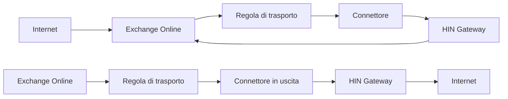

# Integrazione Exchange con HIN Gateway

Questa guida spiega come configurare Microsoft Exchange (Online e On-Premises) per instradare la posta attraverso il gateway HIN Gateway per la firma e la crittografia S/MIME.

<!-- Riferimento interno
     Questa guida è basata sulla pagina wiki [HIN Gateway mail relay setup](https://plan.vereign.com/projects/mail-gateway/wiki/stargate-mail-relay-setup) (di Zdravko Komitov). -->

{ width=32%; }
{ width=32%; }
{ width=32%; }

## Panoramica

HIN Gateway agisce come relay di posta tra server di posta esterni e l'ambiente Exchange. Sono supportati due modelli di integrazione:

**Modello A - Exchange Online come MX primario con regole di trasporto:**



**Modello B - HIN Gateway come MX primario:**

```mermaid
flowchart LR
    I1 --> mx15 --> mx20
    EO --> TR --> OC --> HIN Gateway --> I2
    I1["Internet"]
    I2["Internet"]
    mx15["HIN Gateway (priorità MX 15)"]
    mx20["Exchange Online (priorità MX 20)"]
    EO["Exchange Online"]
    TR["Regola di trasporto"]
    OC["Connettore in uscita"]
    HIN Gateway
```

In entrambi i modelli, sono necessari:

1. **Record DNS** che puntano al server HIN Gateway
2. **Connettore in uscita** - instrada la posta da Exchange a HIN Gateway
3. **Connettore in entrata** - accetta la posta da HIN Gateway in Exchange
4. **Regola di trasporto** - attiva il connettore in uscita per i destinatari esterni

## Prerequisiti

Prima di configurare Exchange, assicurarsi che:

- [X] HIN Gateway sia installato e in esecuzione ([istruzioni di deployment](Docker-deploy.md))
- [X] Si disponga dell'**indirizzo IP pubblico del server HIN Gateway** (indicato come `<HIN_GATEWAY_IP>` di seguito)
- [X] Si disponga del **nome host di posta** del server HIN Gateway (indicato come `<MAIL_HOSTNAME>`, es. `mail.example.com`)
- [X] Si conosca il **dominio di posta** (indicato come `<YOUR_DOMAIN>`, es. `example.com`)
- [X] Si abbia accesso **admin Exchange** (Centro di amministrazione Exchange o Shell di gestione Exchange on-premises)
- [X] I record DNS siano configurati secondo la [Guida alla configurazione DNS](DNS-setup.md) (A, MX, SPF come minimo)

---

## Parte 1: Configurazione DNS

Vedere la [Guida alla configurazione DNS](DNS-setup.md) per istruzioni complete sulla configurazione dei record A, MX, SPF, PTR, DMARC e DKIM.

Come minimo, prima di procedere con la configurazione Exchange di seguito, è necessario:

- **Record A**: `<MAIL_HOSTNAME>` che punta a `<HIN_GATEWAY_IP>`
- **Record MX**: `<YOUR_DOMAIN>` con HIN Gateway a priorità più alta (numero inferiore) rispetto a Exchange
- **Record SPF**: `ip4:<HIN_GATEWAY_IP>` e `ip4:<HIN_SEALER_IP>` aggiunti al record TXT del dominio (vedere [Guida alla configurazione DNS - SPF](DNS-setup.md#record-spf) per gli IP del sigillatore)

---

## Parte 2: Configurazione Exchange Online

### Passo A: Creare il connettore in uscita (Office 365 → HIN Gateway)

Questo connettore instrada la posta in uscita da Exchange Online al server relay HIN Gateway.

1. Accedere al [Centro di amministrazione Exchange - Connettori](https://admin.exchange.microsoft.com/#/connectors)

2. Fare clic su **"+ Aggiungi un connettore"**

3. **Connessione da**: Selezionare **"Office 365"**
   - **Connessione a**: Selezionare **"Server di posta della tua organizzazione"**
   - Fare clic su **"Avanti"**

4. **Nome connettore**: Inserire un nome descrittivo, es.:

   ```plain
   From Office 365 to HIN Gateway relay server
   ```

   - Selezionare **"Mantieni intestazioni email interne di Exchange"**
   - Fare clic su **"Avanti"**

5. **Utilizzo del connettore**: Selezionare **"Solo quando ho una regola di trasporto che reindirizza i messaggi a questo connettore"**
   - Fare clic su **"Avanti"**

!!! tip
    Questo è importante - il connettore non instraderà alcuna posta da solo. Verrà utilizzato solo quando attivato dalla regola di trasporto creata al Passo C.

1. **Routing**: Selezionare **"Instrada le email attraverso questi smart host"**
   - Inserire l'indirizzo IP del server HIN Gateway: `<HIN_GATEWAY_IP>`
   - Fare clic su **"+"** per aggiungerlo, quindi su **"Avanti"**

2. **Restrizioni di sicurezza**: Selezionare **"Qualsiasi certificato digitale, inclusi i certificati auto-firmati"**
   - Fare clic su **"Avanti"**

!!! note
    Il MTA di HIN Gateway (Stalwart) accetta TLS opportunistico sulle connessioni in entrata. Selezionare "qualsiasi certificato digitale" garantisce la connettività anche con certificati auto-firmati.

1. **Email di validazione**: Inserire un indirizzo email valido per il dominio (es. `user@<YOUR_DOMAIN>`)
   - Fare clic su **"+"**, quindi su **"Convalida"**
   - Attendere il completamento della validazione, quindi fare clic su **"Avanti"**

!!! tip
    Affinché la validazione riesca, il server HIN Gateway deve essere in esecuzione e accettare posta sulla porta 25.

1. Rivedere le impostazioni e fare clic su **"Crea connettore"**

2. Nella schermata di conferma, fare clic su **"Fine"**

### Passo B: Creare il connettore in entrata (HIN Gateway → Office 365)

Questo connettore accetta la posta dal server relay HIN Gateway in Exchange Online.

1. Dalla [pagina Connettori](https://admin.exchange.microsoft.com/#/connectors), fare clic su **"+ Aggiungi un connettore"**

2. **Connessione da**: Selezionare **"Server di posta della tua organizzazione"**
   - **Connessione a**: Mostra **"Office 365"** (automatico)
   - Fare clic su **"Avanti"**

3. **Nome connettore**: Inserire un nome descrittivo, es.:

   ```plain
   Receive mail from HIN Gateway relay server
   ```

   - Selezionare **"Mantieni intestazioni email interne di Exchange"**
   - Fare clic su **"Avanti"**

4. **Autenticazione dell'email inviata**: Selezionare **"Verificando che l'indirizzo IP del server di invio corrisponda a uno dei seguenti indirizzi IP che appartengono esclusivamente alla tua organizzazione"**
   - Inserire l'indirizzo IP del server HIN Gateway: `<HIN_GATEWAY_IP>`
   - Fare clic su **"+"** per aggiungerlo, quindi su **"Avanti"**

!!! note
    Questo dice a Exchange Online di fidarsi della posta da questo specifico indirizzo IP, bypassando ulteriori controlli di spam/autenticazione per la posta già elaborata da HIN Gateway.

1. Rivedere le impostazioni e fare clic su **"Crea connettore"**

2. Fare clic su **"Fine"**

### Verificare i connettori

Dopo aver creato entrambi i connettori, la pagina Connettori dovrebbe mostrare:

| Stato | Nome | Da | A |
| -------- | ------ | ------ | ----- |
| Attivo | Receive mail from HIN Gateway relay server | La tua org | O365 |
| Attivo | From Office 365 to HIN Gateway relay server | O365 | La tua org |

### Passo C: Creare la regola di trasporto

La regola di trasporto reindirizza tutta la posta in uscita attraverso il connettore in uscita HIN Gateway, eccetto la posta proveniente da HIN Gateway stesso (per prevenire loop di posta).

1. Accedere al [Centro di amministrazione Exchange - Regole](https://admin.exchange.microsoft.com/#/transportrules)

2. Fare clic su **"+ Aggiungi una regola"** → **"Crea una nuova regola"**

3. **Nome regola**: Inserire un nome descrittivo, es.:

   ```plain
   Relay all mail to HIN Gateway except mail coming from it
   ```

4. **Applica questa regola se**: Selezionare **"Il destinatario..."** → **"è esterno/interno"** → **"Fuori dall'organizzazione"**
   - Fare clic su **"Salva"**

!!! note
    Questa condizione garantisce che solo la posta in uscita (verso destinatari esterni) venga reindirizzata attraverso HIN Gateway.

1. **Fai quanto segue**: Selezionare **"Reindirizza il messaggio a..."** → **"il seguente connettore"** → selezionare il connettore in uscita creato al Passo A (es. "From Office 365 to HIN Gateway relay server")
   - Fare clic su **"Salva"**

2. **Eccetto se**: Fare clic su **"+"** per aggiungere un'eccezione
   - Selezionare **"Il mittente..."** → **"L'indirizzo IP si trova in uno di questi intervalli"**
   - Inserire l'indirizzo IP del server HIN Gateway: `<HIN_GATEWAY_IP>`
   - Fare clic su **"Aggiungi"**, verificare che l'IP sia elencato, quindi fare clic su **"Salva"**

!!! warning
    **Questa eccezione è critica** - previene i loop di posta. Senza di essa, la posta da HIN Gateway che arriva a Exchange Online verrebbe reindirizzata a HIN Gateway in un loop infinito.

1. Rivedere il riepilogo della regola. Dovrebbe mostrare:
   - **Applica questa regola se**: Il destinatario si trova Fuori dall'organizzazione
   - **Fai quanto segue**: Reindirizza il messaggio al connettore "From Office 365 to HIN Gateway relay server"
   - **Eccetto se**: L'indirizzo IP del mittente si trova in uno di questi intervalli: `<HIN_GATEWAY_IP>`

2. Fare clic su **"Avanti"**, poi **"Avanti"** di nuovo, poi **"Fine"**, poi **"Fine"**

3. **Abilitare la regola**: La regola viene creata in stato disabilitato. Fare clic sulla regola nell'elenco e impostare **"Abilita o disabilita regola"** su **"Abilitato"**

!!! tip
    Non dimenticare di abilitare la regola - non funzionerà finché non sarà abilitata.

---

## Parte 3: Configurazione del server Exchange On-Premises

Per Exchange Server On-Premises (2016, 2019), la configurazione è simile ma eseguita tramite la Console di gestione Exchange (EAC) o la Shell di gestione Exchange (PowerShell).

### Connettore di invio (On-Premises → HIN Gateway)

Creare un connettore di invio per instradare la posta in uscita attraverso HIN Gateway:

**Shell di gestione Exchange (PowerShell):**

```powershell
New-SendConnector -Name "To HIN Gateway Relay" `
  -AddressSpaces "SMTP:*;1" `
  -SmartHosts "<HIN_GATEWAY_IP>" `
  -SmartHostAuthMechanism None `
  -DNSRoutingEnabled $false `
  -SourceTransportServers "<IL_TUO_SERVER_EXCHANGE>"
```

**Centro di amministrazione Exchange (GUI):**

1. Accedere a **Flusso di posta** → **Connettori di invio**
2. Fare clic su **+** per creare un nuovo connettore
3. **Nome**: "To HIN Gateway Relay"
4. **Tipo**: Selezionare **"Internet"**
5. **Impostazioni di rete**: Selezionare **"Instrada la posta attraverso smart host"**, aggiungere `<HIN_GATEWAY_IP>`
6. **Autenticazione smart host**: Selezionare **"Nessuna"**
7. **Spazio degli indirizzi**: Aggiungere `*` (tutti i domini) o domini esterni specifici
8. **Server sorgente**: Selezionare il/i server di trasporto Exchange

### Connettore di ricezione (HIN Gateway → On-Premises)

Creare o modificare un connettore di ricezione per accettare la posta da HIN Gateway:

**Shell di gestione Exchange (PowerShell):**

```powershell
New-ReceiveConnector -Name "From HIN Gateway Relay" `
  -Bindings "0.0.0.0:25" `
  -RemoteIPRanges "<HIN_GATEWAY_IP>" `
  -TransportRole FrontendTransport `
  -Usage Custom `
  -AuthMechanism ExternalAuthoritative `
  -PermissionGroups ExchangeServers
```

**Centro di amministrazione Exchange (GUI):**

1. Accedere a **Flusso di posta** → **Connettori di ricezione**
2. Fare clic su **+** per creare un nuovo connettore
3. **Nome**: "From HIN Gateway Relay"
4. **Tipo**: Selezionare **"Trasporto frontend"**
5. **Binding adattatore di rete**: Lasciare predefinito o associare a IP specifico
6. **Impostazioni di rete remote**: Rimuovere il valore predefinito `0.0.0.0-255.255.255.255` e aggiungere solo `<HIN_GATEWAY_IP>`
7. **Autenticazione**: Selezionare **"Sicurezza esterna"**
8. **Gruppi di autorizzazioni**: Selezionare **"Server Exchange"**

### Regola di trasporto (On-Premises)

Creare una regola di trasporto per reindirizzare la posta in uscita attraverso il connettore di invio:

**Shell di gestione Exchange (PowerShell):**

```powershell
New-TransportRule -Name "Relay outbound via HIN Gateway" `
  -SentToScope NotInOrganization `
  -RouteMessageOutboundConnector "To HIN Gateway Relay" `
  -ExceptIfSenderIpRanges "<HIN_GATEWAY_IP>"
```

**Centro di amministrazione Exchange (GUI):**

1. Accedere a **Flusso di posta** → **Regole**
2. Fare clic su **+** → **"Crea una nuova regola"**
3. **Nome**: "Relay outbound via HIN Gateway"
4. **Applica questa regola se**: "Il destinatario si trova..." → "Fuori dall'organizzazione"
5. **Fai quanto segue**: "Reindirizza il messaggio a..." → "il seguente connettore" → "To HIN Gateway Relay"
6. **Eccetto se**: "L'indirizzo IP del mittente è in..." → aggiungere `<HIN_GATEWAY_IP>`

---

## Parte 4: Configurazione lato HIN Gateway

### Configurazione automatica (Predefinita)

Per impostazione predefinita, Stalwart scopre automaticamente dove consegnare la posta elaborata cercando i record MX per ogni dominio configurato tramite la pagina `/mail` del dashboard. Filtra il proprio nome host e utilizza le voci MX rimanenti come destinazioni di consegna.

Funziona quando:

- Il dominio ha record MX che puntano sia a HIN Gateway che a Exchange
- HIN Gateway ha un record MX con priorità più alta (numero inferiore) rispetto a Exchange

### Sostituzione manuale tramite il dashboard

Se si desidera che tutta la posta in uscita da HIN Gateway vada a un singolo endpoint Exchange (es. Exchange Online Protection), impostare l'host di relay tramite la pagina `/mail` del dashboard (es. `[smtp.office365.com]`). Il dashboard invia il valore all'API REST di mtaconf e il demone lo applica a Stalwart.

!!! note
    Un singolo host di relay invia tutta la posta attraverso un server e non supporta il routing per dominio. Per più domini instradati attraverso server Exchange diversi, utilizzare la mappa di relay per dominio sulla stessa pagina del dashboard (configura `sender_dependent_relayhost_maps` internamente) - vedere [Configurazione multi-dominio](#configurazione-multi-dominio) di seguito.

### Configurazione multi-dominio

Per configurazioni con più domini e server Exchange diversi (es. BALZ Informatik AG con 26 domini), utilizzare i record MX per il routing per dominio:

```plain
domain1.com    MX 10  exchange1.domain1.com
domain1.com    MX 20  stargate.domain1.com

domain2.com    MX 10  exchange2.domain2.com
domain2.com    MX 20  stargate.domain2.com
```

I record MX di ogni dominio dicono a HIN Gateway dove consegnare la posta elaborata per quel dominio specifico.

### Verificare la configurazione di HIN Gateway

Dopo la configurazione, verificare la configurazione di Stalwart:

#### Verificare la configurazione del relay

```bash
docker logs stargate-stalwart --tail 50 | grep -i relay
```

#### Verificare la coda di posta (dovrebbe essere vuota quando tutto funziona)

```bash
docker exec stargate-stalwart stalwart-cli -u http://localhost:8080 queue list
```

#### Inviare un'email di test e controllare i log

```bash
docker logs stargate-stalwart --tail 50
```

## Risoluzione dei problemi

### La posta non esce da Exchange Online

- Verificare che la regola di trasporto sia **abilitata** (viene creata in stato disabilitato)
- Controllare le condizioni della regola - dovrebbe applicarsi ai destinatari "Fuori dall'organizzazione"
- Verificare che la validazione del connettore in uscita sia riuscita
- Controllare la traccia dei messaggi Exchange nel Centro di amministrazione per lo stato di consegna

### Loop di posta (messaggi duplicati)

- Assicurarsi che la regola di trasporto abbia **l'eccezione** per l'indirizzo IP di HIN Gateway
- Senza questa eccezione, la posta da HIN Gateway che arriva a Exchange viene reindirizzata a HIN Gateway

### HIN Gateway non accetta posta da Exchange

- Controllare che la porta 25 sia aperta sul firewall del server HIN Gateway
- Verificare che il record SPF includa l'IP HIN Gateway
- Controllare i log Stalwart: `docker logs stargate-stalwart`

### Exchange Online rifiuta la posta da HIN Gateway

- Verificare che il connettore in entrata sia configurato con il corretto IP HIN Gateway
- Controllare che l'IP HIN Gateway non sia cambiato
- Verificare che il connettore sia abilitato (Stato: Attivo)

### Errori del certificato TLS

HIN Gateway utilizza TLS opportunistico con un certificato auto-firmato. Il connettore in uscita in Exchange deve essere configurato per accettare "Qualsiasi certificato digitale, inclusi i certificati auto-firmati". Se si vedono errori relativi a TLS:

- Verificare che l'impostazione di sicurezza del connettore in uscita consenta certificati auto-firmati
- Per Exchange On-Premises, assicurarsi che il connettore di invio non richieda TLS (`-RequireTLS $false`)

### La validazione fallisce durante la creazione del connettore

La validazione del connettore in uscita richiede:

- Il server HIN Gateway è in esecuzione e accetta connessioni sulla porta 25
- L'indirizzo email di validazione è valido per il dominio
- Il percorso di rete tra Exchange Online e HIN Gateway è aperto (nessun blocco firewall)

---

## Riferimento rapido

| Componente | Posizione Exchange Online | Scopo |
| ----------- | -------------------------- | --------- |
| Connettore in uscita | Centro di amministrazione → Flusso di posta → Connettori | Instradare la posta in uscita a HIN Gateway |
| Connettore in entrata | Centro di amministrazione → Flusso di posta → Connettori | Accettare la posta da HIN Gateway |
| Regola di trasporto | Centro di amministrazione → Flusso di posta → Regole | Attivare il connettore in uscita per i destinatari esterni |

| Record DNS | Esempio | Scopo |
| ------------ | --------- | --------- |
| A | `mail IN A <HIN_GATEWAY_IP>` | Puntare il nome host a HIN Gateway |
| MX (HIN Gateway) | `@ IN MX 15 mail.<YOUR_DOMAIN>.` | La posta in entrata colpisce prima HIN Gateway |
| MX (Exchange) | `@ IN MX 20 <DOMAIN>.mail.protection.outlook.com.` | Fallback / destinazione di consegna |
| SPF | `ip4:<HIN_GATEWAY_IP>` e `ip4:<HIN_SEALER_IP>` aggiunti al record TXT esistente | Autorizzare HIN Gateway e il sigillatore HIN a inviare posta |

Per la configurazione DNS completa (inclusi PTR, DMARC, DKIM e multi-dominio), vedere la [Guida alla configurazione DNS](DNS-setup.md).
